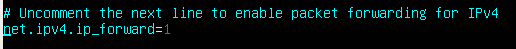

# Pràctica 1 - Muntant l'arquitectura de xarxa

## Configuració de les màquines
Atenent al diagrama de xarxa, veiem que el Ubuntu Server ha de tindre dues interfaces de xarxa i el Xubuntu una.
Això es tradueix en que el Ubuntu Server tindrà configurats dos adaptadors de xarxa i el Xubuntu un.


### Ubuntu Server
Ja que ha de tindre una IP de la mateixa LAN que l'ordinador físic on està creada aquesta màquina virtual, un dels adaptadors de xarxa ha de ser, sense dubte, adaptador pont o “bridge”:


A més, ja que formará una xarxa privada juntament amb l'altra màquina virtual, la xarxa formada per aquestes dues màquines serà una Xarxa Interna:


### Xubuntu (client)
Si mirem el diagrama de xarxa, Xubuntu únicament té una interfície de xarxa. Aquesta interfície està a la xarxa privada que forma juntament amb el Ubuntu Server, ja que tots dos equips estan connectats directament. Així doncs:


Ja hem configurat les interfícies, o el que és el mateix, és com si haguéssim connectat tots els cables físicament per formar l'arquitectura que podeu vore dibuixada en el diagrama. 

### Configuració d'interfaces amb netplan


Ara hem de configurar les IPs dins de cada màquina virtual. Per a això utilitzarem el configurador d'interfícies de xarxa en Linux, “netplan”.

Les interfícies han de configurar-se en un arxiu de text en llenguatge “yaml”. Aquest arxiu està localitzat en: 

``` 
/etc/netplan
```
 
Per saber quines són les nostres interfícies, hem d'utilitzar el comando “ip a” Si comprovem el server:


Veiem que tenim la interfície de loopback que no ens preocupa i dues interfícies més, enp0s3 i enp0s8. 

La primera es correspon amb la primera que tenim configurada en la màquina, és a dir, l'adaptador pont. Això ho sabem perquè ja té assignada una IP automàticament.

La segona, enp0s8, és la que es correspon amb la xarxa interna i és la que hem de configurar en l'arxiu de netplan de la següent forma:


enp0s3 apareix ja en l'arxiu configurada automàticament per DHCP. En roig s'assenyala el que hem d'afegir, la nova interfície i la seua IP 

!!!attention "Atenció"
    Recordeu posar la **VOSTRA** ip. 

!!!tip "Recordatori"
    Cura amb les indentacions, els espais i editeu l'arxiu amb **sudo** o no us deixarà. 
    
Després de realitzar aquesta configuració, hem d'aplicar-la-hi a la màquina, sinó no es produiran els canvis. Es poden utilitzar els comandos:

``` shell
sudo netplan try
``` 


 Prova la configuració abans d'aplicar-la


Si li donem a enter apliquem la configuració, si esperem al fet que el comptador arribi a 0, la configuració no s'aplicarà. 

``` shell
sudo netplan apply
``` 


 Aplica la configuració directament

!!!attention "Atenció" 
    Recordeu que és MOLT IMPORTANT que després d'aplicar una configuració la comprovem. De gens serveix fer canvis i no comprovar que aquestos s'han produït.


Així doncs, veiem que cada interfície està configurada amb la seua IP correctament. En el client Xubuntu el procés seria el mateix i si, després de comprovar-ho, tot està correcte, podrem fer ping des del Ubuntu Server al Xubuntu i viceversa.

## Configuració del enrutament o encaminament
Ara, tots tindreu configurada una de les interfícies del Ubuntu Server a la LAN de classe. El següent pas va a ser aconseguir que, treballant per parelles, l'ALUMNE 1, des del seu client Xubuntu puga fer ping al Xubuntu de l'ALUMNE 2


Us heu d'adonar que aquest ping ara mateix NO es pot realitzar ja que tots dos Xubuntu estan en xarxes privades diferents i no hi ha forma de que aquestes xarxes es “vegin”. El Ubuntu Server fa de router i per tant un router separa xarxes, de tal forma que ni el Server 1, ni el Xubuntu 1 veuran la xarxa privada de l'Alumne 2 i viceversa.

Si recordeu de Xarxes d'Àrea Local, la forma de que un router puga encaminar paquets a xarxes llunyanes era que aquest router “aprenguera” aquestes xarxes mitjançant algoritmes d'encaminament. Aquests algoritmes podien ser:

* Dinàmics: el router aprenia ell a soles, intercanviant informació amb altres routers
  
* Estàtics: es configuraven les rutes cap a altres xarxes a mà
  
Per al cas que ens ocupa, utilitzarem rutes estàtiques que hem de configurar en el nostre router, en aquest cas el Ubuntu Server.
Per qüestions de seguretat, Linux no pot actuar com a router per defecte, fa falta activar aquesta funcionalitat. Així doncs, anem a activar el que es denomina com a **bit de forwarding**. Això ho podem fer mitjançant el següent comando:

``` shell
sysctl -w net.ipv4.ip_forward=1
```
No obstant això, en aquest cas el canvi serà temporal i quan es reiniciï el Server, es perdrà la configuració. Per a que aquest canvi siga persistent, hem de modificar l'arxiu:

``` shell
/etc/sysctl.conf
```

I buscar la línia que posa:

```shell
# net.ipv4.ip_forward = 0
```

i eliminar el coixinet inicial i canviar el 0 per un 1:



Guardem l'arxiu i activem els canvis amb el comando:

```shell
sysctl -p
```
####  Rutes estàtiques
El comando que hem d'introduir en Linux per configurar una ruta estàtica és:

```shell
sudo ip route add xarxa via gateway
```
On:

* Xarxa: la xarxa a la qual volem arribar 
  
    !!!danger "Ull viu!"
        L'adreça de xarxa, no la IP del dispositiu

* Gateway: el següent salt al que cal manar el paquet per aconseguir la xarxa que volem

A més, com el client Xubuntu no coneixerà la xarxa a la qual li anem a fer ping, necessita saber per on enviar paquets quan no coneix la xarxa destí. Això es coneix com gateway per defecte o porta d'enllaç. La porta d'enllaç serà el router/Ubuntu Server. 
Ja hem dit que tota la configuració de xarxa es fa en l'arxiu que utilitza netplan, així doncs el gateway s'ha de configurar així:


On en gateway4 heu de posar la IP del vostre Server.

Suposem en el nostre cas que l'ALUMNE 1 té la següent configuració:

**Ubuntu Server**

```
enp0s3: 192.168.10.10
enp0s8: 172.1.1.1
```
**Xubuntu**
```
enp0s3: 172.1.1.2
```

I que l'ALUMNE 2 té aquesta configuració:

**Ubuntu Server**
```
enp0s3: 192.168.10.20
enp0s8: 172.1.6.1
```
**Xubuntu**
```
enp0s3: 172.1.6.2
```

A quina interfície ha de manar el router de l'ALUMNE 1 el paquet per arribar a la xarxa de l'ALUMNE 2, la 172.1.6.0/24?

Si mireu el dibuix us adonareu que el següent salt és el router de l'ALUMNE 2.

* Configureu la ruta estàtica necessària.
  
* Comproveu que la ruta està bé mitjançant el comando que mostra les rutes:

```shell
ip route
```

Després d'introduir correctament la configuració, comproveu si funciona el ping d'un Xubuntu a un altre. Us adonareu que no funciona.

Per què no? Perquè el paquet sap arribar de *Xubuntu1* a *Xubuntu2* però no sap tornar → ALUMNE 2 també ha de configurar una ruta estàtica per poder arribar a la xarxa privada d'ALUMNE 1.

!!! question "Tasca"
    Configureu les rutes estàtiques en tots dos Servers/routers.

Finalment hauries de poder fer ping.

Si us equivoqueu ficant les rutes, les podeu eliminar amb el mateix comando però canviant *“add”* per *“del”*.


## Toc final

ja que les rutes estàtiques s'esborraran quan el servidor es reiniciï per qualsevol raó, anem a escriure el comando 

```shell
sudo ip route add xarxa via gateway
```

(amb els paràmetres que hàgiu utilitzat vosaltres) en un arxiu de text que es cridarà:

```shell
rutes_estatiques.sh
```

I ho aneu a guardar al directori:

```
/etc/network
```
I donar-li permisos d'execució:

```shell
chmod +x rutes_estatiques.sh
```

Per comprovar que funciona, el comando que heu d'executar és:
```shell
sudo sh rutes_estatiques.sh
```
I comproveu que us ha configurat les rutes.


!!!caution "Atenció per a l'informe"
    Documenta tota la pràctica amb les captures de pantalla corresponents de cada configuració i comprovació.


## Avaluació

| Criteri      | Puntuació                         |
| :--------- | :----------------------------------: |
| Configuració de xarxa correcta amb netplan d'ambdues màquines       |**4 punts**  |
| Configuració correcta de l'encaminament entre els dos alumnes en les dos direccions      | **5 punts** |
| S'ha tingut cura amb el format del document, utilitzant la plantilla actualitzada i fent ús d'un correcte llenguatge tècnic    | **1 punt**|
| Configuració extra d'un segon client      |**+0,5 punts (extra)**  |

