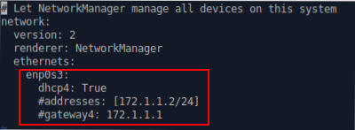
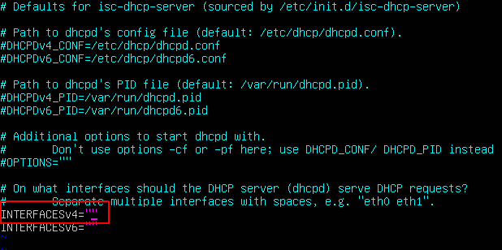
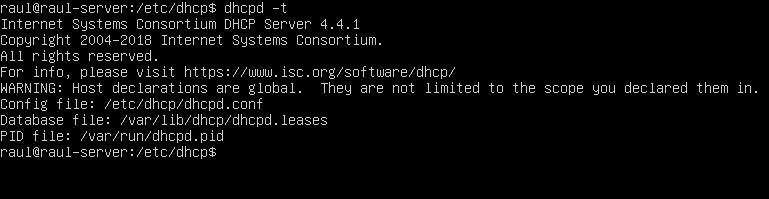
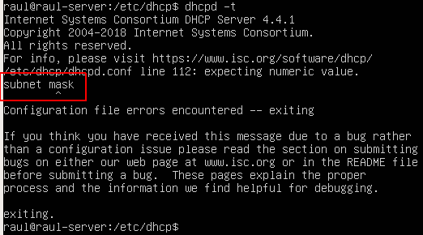

# Pràctica 2.1 - Instal·lació i configuració de servidor DHCP

## Instal·lació del servidor DHCP
Per instal·lar el servidor DHCP en Ubuntu Server, usarem els repositoris oficials. Per això, podrem instal·lar-ho com qualsevol paquet en Ubuntu:
```shell
suo apt-get install isc-dhcp-server
```
## Configuració del client
Si recordem de la pràctica 1, el client té ara mateix configurada la IP de forma estàtica ja que la vam posar a mà en l'arxiu localitzat en el directori ***/etc/netplan***.

Com el nostre objectiu és muntar un servidor DHCP en l'Ubuntu Server que assigni IPs a tots els clients que hi hagi en aquesta xarxa, els clients han d'estar configurats de tal forma que obtinguin aquesta adreça per DHCP també.

Així doncs, amb el coixinet comentem les línies on li indicàvem al servidor quin era la IP i el gateway perquè no es tinguin en compte i li indiquem que obtingui aquesta informació mitjançant el DHCP.



!!!Info "Recordatori"
    Recordeu aplicar la configuració després de canviar-la.

## Configuració del servidor DHCP

Abans de gens, atès que el servidor té dues interfícies, la de l'adaptador pont (enp0s3) i la de la xarxa interna (enp0s8), hem d'indicar-li en quin d'elles ha d'assignar les IPs.

Això es fa editant l'arxiu:

```shell
isc-dhcp-server
```

Que podeu trobar en el directori:

```shell
/etc/default
```


Podem afegir una interfície de tipus IPv4 o IPv6. ja que nosaltres estem treballant amb adreces IP d'IPv4, hem d'editar la línia assenyalada en roig. Entre cometes posarem el nom de la interfície on es van a assignar les IP

!!!tip "Consell"
    * Recordeu quin era el comando per consultar el nom de les interfícies
    * Observeu en el diagrama de xarxa quina serà la interfície per on s'han d'assignar les IP
  
Ara que ja li hem dit al servidor quin interfície ha d'utilitzar, anem a configurar tot el relacionat amb el DHCP.

L'arxiu per configurar el servidor DHCP està en el directori:

```shell
/etc/dhcp
```

I el fitxer es diu:

```shell
dhcpd.conf
```

Tenint en compte els exemples de configuració d'aquest arxiu que hem vist en teoria i que podeu consultar en el PDF del tema 2, heu de configurar el servidor amb els següents paràmetres:

* El rang ha d'anar des de la IP de la interfície corresponent número 3, fins a la 10. És a dir, s'han d'assignar les IPs des de la X.X.X.3 fins a la X.X.X.10. (X.X.X.0 és la xarxa de la interfície on ha d'estar el DHCP)
  
* Heu d'enviar-li també la porta d'enllaç als clients als quals assigneu la IP 
  
* També heu d'enviar-li als clients els DNS, que seran dos: *1.1.1.1* i *8.8.8.8*
  
Per a comprovar si la configuració la teniu bé, en el terminal podeu utilitza el comando:

```shell
dhcpd -t
```

Si la teniu bé, apareixerà alguna cosa com això:



I si està malament us indicarà l'error:



(Després de “subnet” no va “mask)

Quan comproveu que la configuració està bé, reinicieu el servici DHCP amb el següent comando:

```shell
sudo systemctl restart isc-dhcp-server
```
I hauria d'assignar-li la IP al client.

!!!warning
    Com sempre, heu de comprovar que tot està bé després de configurar-lo. 

    Per a veure en el client la IP que us ha assignat el servidor:
    
    ```shell
    ip a
    ```

    Recordeu que donat que la primera IP que assigna la IP X.X.X.3, **NO** podeu tenir la mateixa IP que quan abans la teníeu estàtica, que era la X.X.X.2

    Per a comprovar si us ha afegit la ruta per defecte, és a dir, el gateway:
    
    ```shell
    ip route
    ```
    I haurà d'aparèixer una ruta del tipus:
    
    ```
    default via porta_de_enllaç dev interfície ...
    ```

    Si ho teniu tot en ordre, podreu seguir fent ping a un equip client d'un altre company, tal i com vam fer en la pràctica 1.

## Afegir un client DHCP amb IP reservada
Per a aquesta part de la pràctica, en Virtualbox heu de clonar la màquina client (Xubuntu).

Amb la màquina apagada → “Màquina → Clonar”. 

I la iniciem per tenir dos clients a la nostra xarxa interna.

A aquesta màquina, anem a reservar-li la mateixa IP sempre. Si consulteu l'apartat de “Reserves” del tema de teoria, teniu un exemple de com configurar això en l'arxiu **dhcpd.conf**

Recordeu que aquesta configuració ha d'estar just sota la qual ja teniu i entre les claus del bloc:

```shell
subnet x.x.x.x netmask x.x.x.x {
	La vostra configuració anterior
	La configuració per a la IP reservada ← Aquí
}
```

La IP fixa ha de ser la número 11 → **X.X.X.11**

Realitzeu la mateixes comprovacions que en l'apartat anterior (el client té bé la IP, el gateway/porta d'enllaç, pot fer ping al client d'un altre company).

Recordeu que després de canviar la configuració del servidor DHCP sempre heu de reiniciar el servici amb el comando vist anteriorment:

```shell
sudo systemctl restart isc-dhcp-server
```
!!!info "Nota"
    L'adreça física/MAC/hardware address, la podeu consultar en la interfície corresponent amb el comando:

    ```shell
    ip a 
    ```

## Ultima comprovació

Finalment, ja vam dir en la part de teoria que el servidor ha de portar un registre de quin IPs ha assignat i quan, ja que caduquen. 

Aquest registre es pot consultar en el directori:

```
/var/lib/dhcp
```

En l'arxiu 

```
dhcpd.leases
```

(Poden aparèixer arxius del tipus dhcpd.leases, que són temporals i heu d'ignorar)

Aquí podreu veure totes les IP que ha assignat el servidor, a quina hora i quan caduquen, entre altres coses. 

Adjunteu també una captura de pantalla del contingut d'aquest arxiu.

!!!caution "Atenció per a l'informe"
    Documenta tota la pràctica amb les captures de pantalla corresponents de cada configuració i comprovació.

## Avaluació

| Criteri      | Puntuació                         |
| :--------- | :----------------------------------: |
| Configuració del servidor DHCP       |**4 punts**  |
| Afegir un client amb IP reservada      | **3 punts** |
| Evidències de les comprovacions del correcte funcionament | **2 punts**|
| S'ha tingut cura amb el format del document, utilitzant la plantilla actualitzada i fent ús d'un correcte llenguatge tècnic |**1 punt**  |