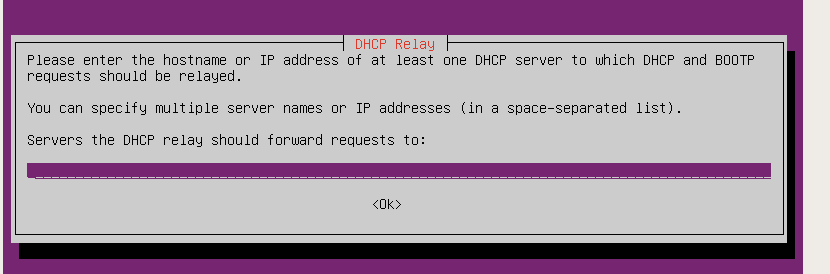
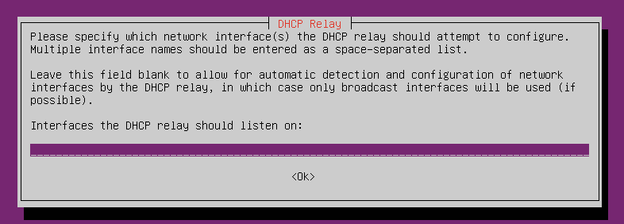
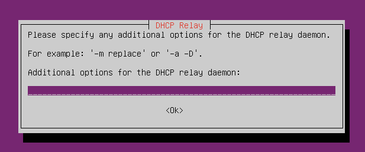
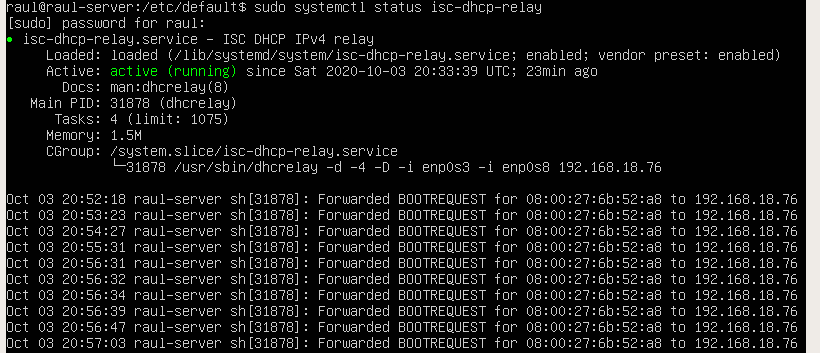
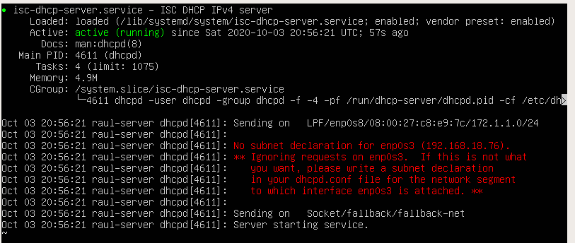
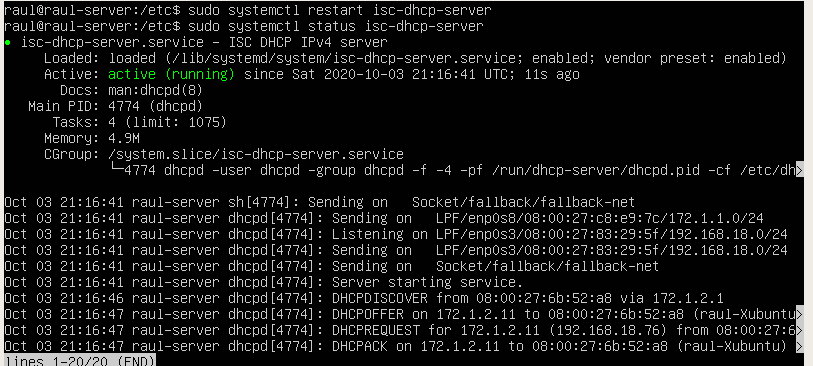

# Pràctica 2.2 - DHCP Relay

!!!danger "Atenció, molt important!"
    Per realitzar aquesta pràctica és **imprescindible** que tingueu funcionant correctament l'escenari de la Pràctica 1. 
    
    **Comproveu-ho** abans d'iniciar aquesta.


## Introducció

En ocasions pot ser que una empresa posseeixi oficines en diferents punts d'Espanya. D'acord amb la lògica que hem seguit en la pràctica anterior, podríem pensar que hem de muntar un servidor DHCP en cadascuna de les LAN de cada oficina que tinguin per Espanya.

No obstant això, aquesta opció va totalment en contra del que vam veure en la teoria a propòsit dels servidors DHCP, és a dir, augmenta la complexitat per mantenir el repartiment i assignació d'IP ja que perdem la centralització en un només servidor i arxiu de configuració.

Per a solucionar això sorgeix el DHCP relay, que és la situació on un servidor intermedi fa les vegades de repetidor i envia les peticions DHCP a un servidor remot, que serà el que assigna les IP. 

Seria el cas de que totes les oficines enviessin les peticions DHCP al servidor localitzat a Elx i fos aquest el que assignés les IP de tots els equips de la resta d'oficines d'Espanya.

Així només hauríem de mantindre un únic servidor DHCP, el d'Elx, facilitant i simplificant en gran mesura el treball.


## Configuració del client

Els clients no requereixen de cap configuració addicional. En la Pràctica 2.1 ja els vau configurar perquè adquirissin la IP mitjançant DHCP i així han de seguir.

## Configuració del servidor

Si recordem l'escenari de la Pràctica 1:


Veiem que aquesta pràctica l'heu de fer per parelles o, en defecte d'això, amb 4 màquines virtuals com s'ha explicat en classe.

Haureu d'alternar-vos perquè primer un sigui el relay i l'altre el servidor DHCP i després canviïn els rols.

Així doncs, en el primer cas, el servidor/router de l'Alumne 1 serà el que redirigeixi les peticions DHCP dels seus clients al servidor/router de l'Alumne 2 a través de la interfície de la LAN de classe/casa.

**En aquest router/servidor, a l'arxiu ```/etc/default/isc-dhcp-server``` teniueu posat l'interfaz de la xarxa interna. Com hara rebreu les peticions DHCP del relay per l'interfaz LAN haureu d'afegir a l'apartat "INTERFACESv4" el nom d'eixa interfaz.**


### Parada del servidor DHCP

En primer lloc és **imprescindible** que l'alumne que vagi a fer de DHCP relay pari el seu servidor DHCP, ja que el que va a fer és delegar aquesta responsabilitat en el servidor DHCP del company, redirigint-li les peticions que li arribin.

Per a parar-lo:

```shell
sudo systemctl stop isc-dhcp-server
```

### Instal·lació del DHCP relay

Per instal·lar el servidor DHCP relay en Ubuntu Server, usarem els repositoris oficials. Per això, podrem instal·lar-ho com qualsevol paquet en Ubuntu:

```shell
sudo apt install isc-dhcp-relay
```
Per completar la instal·lació, us farà 3 preguntes amb les quals generarà l'arxiu de configuració que generarà en el directori **/etc/default** amb el nom d'arxiu **isc-dhcp-relay**:



Ací vos pregunta quina és l'adreça IP destí a on ha de redirigir les peticions DHCP que reba. 

Com aneu a redirigir-les per la interfície de la LAN cap al server del vostre company, heu d'indicar-li l'adreça IP de la interfície LAN del server del vostre company.



Aquí us pregunta en quina interfície va a rebre peticions DHCP dels clients. 

La lògica dicta que com només té clients en la interfície de la xarxa interna, aquesta sigués l'única interfície que poséssim aquí. No obstant això, si fem això, el servidor descartaria les respostes que provenen del servidor del vostre company, ja que arriben per l'altra interfície, per la LAN (observeu el dibuix amb deteniment per poder entendre-ho).

Així doncs, perquè funcioni correctament tot, heu de posar el nom d'ambdues interfícies separades per un espai.



Finalment us pregunta si voleu executar el programa amb alguna opció. Heu d'indicar-li que amb l'opció -D perquè s'executi com a dimoni.

## Configuració DHCP Server

Com és obvi, el servidor DHCP del vostre company haurà de tindre configurat en el seu dhcpd.conf (que ja vam veure on estava en la Pràctica 2) tant el rang d'IP de la seva xarxa com el rang d'IP de la vostra xarxa. 

És a dir, el dhcpd.conf ha de tenir declarades dos subnets, les xarxes internes dels dos alumnes.

En canviar la configuració recordeu que podeu comprovar si està bé amb:

```shell
dhcpd -t
``` 
I per a que s'aplique la configuració, heu de reiniciar el servei:

```shell
sudo systemctl restart isc-dhcp-server
```

## Comprovació

Forceu al client Xubuntu al fet que reconfigure la seva xarxa perquè comenci a buscar IP per DHCP una altra vegada:

```shell
sudo netplan apply
```

Ara podreu veure l'estat del DHCP relay escrivint:

```
sudo systemctl status isc-dhcp-relay
```



Veurem com el servei està actiu i funcionant correctament (active (running)) i que està redirigint les peticions de la MAC del vostre client a la IP del servidor del vostre company.

I l'estat del servidor DHCP del vostre company amb:

```shell
sudo systemctl status isc-dhcp-server
```



Ací notem que malgrat que el servici DHCP està actiu i funcionant correctament, es produeix un error que ens indica en roig que efectivament alguna cosa està malament.

El que està dient aquest error és que el servidor DHCP ha detectat que està rebent peticions/missatges DHCP per la interfície LAN. No obstant això, en el dhcpd.conf, les úniques xarxes que hi ha configurades són les internes dels dos alumnes, 1 i 2. 

Com en l'arxiu dhcpd.conf no apareix configurat gens relacionat amb la interfície LAN, les peticions DHCP d'aquesta interfície s'ignoren, per la qual cosa no està contestant a les peticions del DHCP relay.

Per solucionar això, simplement hem de dir-li al servidor DHCP que aquesta interfície també participarà en tot el procés DHCP i que per favor tingui en compte el que li arribe per aquesta interfície.

**Com?**

En l'arxiu dhcpd.conf heu de fer una nova declaració d'una subnet, en aquest cas la de la interfície LAN. 

La declaració estarà buida, és a dir, només posareu l'adreça de xarxa i la màscara, entre les claus no haurà contingut perquè òbviament no es va a assignar cap IP en aquesta interfície (això ja ho fa el router de classe/casa).

## Nova comprobació

Si una vegada configurat l'anterior tornem a comprovar l'estat de tots dos serveis, el DHCP relay de l'alumne 1 i el servidor DHCP de l'alumne 2:

* Veurem que el DHCP relay segueix redirigint les peticions adequadament
  
* En el servidor DHCP ara veurem que ja sí s'estan assignant IP posat que apareixen els missatges DHCP que vam veure en teoria, en la interfície de la LAN:



Ací es pot veure com s'ha assignat la IP 172.1.2.11 a un client d'una altra xarxa interna.

Si comproveu el client Xubuntu de l'alumne 1, el que ha configurat el DHCP relay, ara ja tindrà IP assignada.

!!!note "Nota"
    Si després de configurar-ho tot no funciona, comproveu que heu reiniciat els serveis dels quals hàgiu canviat la configuració. A més, feu un
    ```
    sudo netplan apply
    ```
    en el client per forçar-li a que torne a intentar buscar IP.

!!!caution "Atenció per a l'informe"
    Documenta tota la pràctica amb les captures de pantalla corresponents de cada configuració i comprovació. 

## Questions finals

!!!Task "Questió 1"

Si l'*alumne 1* està fent de **servidor DHCP** i l'*alumne 2* està fent de **relay**, imaginem que l'alumne 2 afegix al seu Ubuntu server (que, recordem, fa de relay) una interfície que es crida ^^enp0s15^^. 
   
En aquesta interfície, l'alumne 2 decidix crear la nova xarxa 10.10.10.0/24 amb un sol client Xubuntu, on la interfície del router té la IP 10.10.10.1 i el client Xubuntu la IP 10.10.10.2

Explica detalladament tot el que hauríem de configurar per tal de que el server DHCP de l'alumne 1 puga donar IP també en el rang d'eixa nova xarxa del company i, concretament, en el rang 10.10.10.50 - 10.10.10.150

!!!Task "Questió 2"

Imagineu que el comando ```dhcpd -t``` vos diu que teniu un error en  l'arxiu ```dhcpd.conf```, el detecteu i editeu l'arxiu solucionant l'error. No obstant això, el server dhcp continua donant error. ¿Qué més fa falta, a més d'editar l'error de ```dhcpd.conf```?

!!!Task "Questió 3"

En aquesta captura:


A qui pertany la direcció MAC i qui pertany la IP ```192.168.18.76```?

!!!Task "Questió 4"

Com puc saber o a on puc vore quines IP ha assignat ja el servidor DHCP?

!!!Task "Questió 5"

Podría assignar una IP fixa a la xarxa del meu company? Explica detalladament quina configuració faría falta.


## Avaluació

| Criteri      | Puntuació                         |
| :--------- | :----------------------------------: |
| Configuració correcta del servidor DHCP       |**2 punts**  |
| Configuració correcta del relay      | **2 punts** |
| Evidències de les comprovacions del correcte funcionament | **2 punts**|
| Questions finals | **3 punts**|
| S'ha tingut cura amb el format del document, utilitzant la plantilla actualitzada i fent ús d'un correcte llenguatge tècnic |**1 punt**  |

