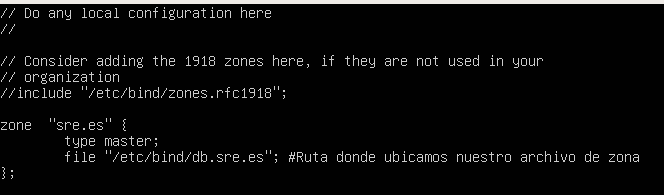
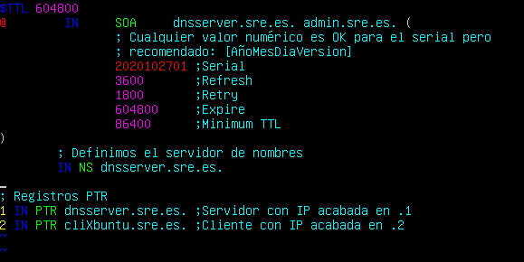

# Pràctica 3.1 - Configuració d'un servidor DNS

!!!danger "Atenció, molt important abans de començar!"
    ✔ Heu de tindre el servidor, el client i a més un clon de el client. Tots dins de la mateixa xarxa interna.

    ✔ Heu de tindre configurat el servidor DHCP per que assigne adreces IP fixes als dos clients.

    ✔ IMPORTANT: A l'clonar la màquina client, per poder assignar IPs fixes en el DHCP, necessiten tenir adreces MAC diferents:        

    


## Instal·lació de servidor DNS

Bind és l'estàndard de facto per a servidors DNS. És una eina de programari lliure i es distribueix amb la majoria de plataformes Unix i Linux, on també se li coneix  amb el sobrenom de named (name daemon). Bind9 és la versió recomanada per a usar-se i és la que utilitzarem. 

Per instal·lar el servidor DNS en Ubuntu Server, farem servir els repositoris oficials. Per això, podrem instal·lar com qualsevol paquet a Ubuntu:

```sh
sudo apt-get install bind9 bind9utils bind9-doc 
```

## Configuració del servidor

Ja que a classe només utilitzarem IPv4, anem a dir-ho a Bind, en el seu arxiu general de configuració. Aquest fitxer ("named") es troba en el directori:

```shell
/etc/default
```

I per indicar-li que només faci servir IPv4, hem de modificar la línia següent amb el text ressaltat:

```shell
OPTIONS = "-u bind -4"
```

L'arxiu de configuració principal (named.conf) de Bind està en el directori:

```shell
/etc/bind
```
Si ho consultem veurem el següent:


Aquest fitxer serveix simplement per aglutinar o agrupar els arxius de configuració que farem servir. Aquests 3 includes fan referència als 3 diferents arxius on haurem de realitzar l'autèntica configuració, ubicats en el mateix directori.

### Configuració *named.conf.options*

És una bona pràctica que feu sempre una còpia de seguretat d'un arxiu de configuració cada vegada que aneu a realitzar algun canvi:.

```shell
sudo cp /etc/bind/named.conf.options /etc/bind/named.conf.options.backup
```
Ara editarem l'arxiu ***named.conf.options*** i inclourem els següents continguts:

* Per motius de seguretat, anem a incloure una llista d'accés perquè només puguin fer consultes recursives a servidor aquells hosts que nosaltres decidim.

    En el nostre cas, els hosts fiables seran els de la xarxa 172.1.X.0/24. Així doncs, just abans del bloc "options {...}", al principi de l'arxiu, afegirem alguna cosa així:

    

Si ens fixem el servidor per defecte ja ve configurat per a ser un DNS caché. El directori on es cachearan o guardaran les zones és:

```
/var/cache/bind
```

Ara hem de configurar els següents aspectes dins de l'bloc "options {...}":

* Que només es permeten les consultes recursives als hosts que hem decidit en la llista d'accés anterior.

* No permetre transferència de zones a ningú, de moment.

* Configurar el servidor perquè escolti consultes DNS al port 53 (per defecte DNS utilitza port 53 UDP) ia la IP de la seva interfície de la xarxa privada. Haureu col·locar la IP de la interfície connectada a la xarxa privada de servidor, ja que resoldrà les consultes DNS de el client/s d'aquesta xarxa.

* Permetre les consultes recursives, ja que en el primer punt ja li hem dit que només puguin fer-les els hosts de l'ACL.

* A més, comentarem la línia que posa "listen-on-v6 {any; }; " ja que no anem a respondre a consultes d'IPv6. Per a comentar-la n'hi ha prou amb afegir al principi de la línia dues barres (//).
   
       
     


Podem comprovar si la nostra configuració és correcta amb el comando:


Si hi ha algun error, ens ho farà saber. En cas contrari, ens torna a la línia de comandos.

Reiniciem el servidor i comprovem el seu estat:


### Configuració *named.conf.local*

En aquest arxiu configurarem aspectes relatius a les nostres zones. Declararem la zona "sre.es". Per ara simplement indicarem que el servidor DNS és mestre per a aquesta zona i on estarà ubicat el fitxer de zona que crearem més endavant:




### Creació de l'arxiu de zona

Crearem l'arxiu de zona de resolució directa justament en el directori que hem indicat abans i amb el mateix nom que hem indicat abans.

El contingut serà una cosa així (procureu respectar el format):


Recordeu de teoria que els registres SOA són per a detallar aspectes de la zona autoritativa, els NS per indicar els servidors DNS de la zona i els A les IPs respectives.

On apareixen les X heu de posar les vostres IPs privades corresponents, tant del vostre servidor com del vostre client.

### Creació de l'arxiu de zona pera a la resolució inversa

Recordeu que hi ha d'haver dos arxius de zona, un per a la resolució directa i un altre per a la inversa. Anem doncs a crear l'arxiu de zona inversa.

En primer lloc, hem d'afegir les línies corresponents a aquesta zona inversa a l'arxiu named.conf.local, igual que hem fet abans amb la zona de resolució directa:


On la X es el tercer byte de la vostra xarxa interna.

Y la configuración de la zona de resolució inversa:



Podem comprovar que la configuració de les zones es correcta amb el comando adequat.

### Comprovació de les configuracions

Per a comprovar la configuració de la zona de resolució directa:

m

Y per a comprovar la configuració de la zona de resolució inversa:


Si tot ha anat bé, retornarà OK. En cas de que haja qualsevol error, ens n'informarà.

Reiniciem el servici y comprovem l'estat:


!!!warning "Atenció!"
    És molt important que el client estiga configurat per utilitzar com a servidor DNS el que acabem d'instal·lar i configurar.

    Però, com podem fer això? Cal recordar que el client està configurat per DHCP i que DHCP permetia una completa configuració de xarxa, a més de la IP. Consulteu al Tema 2 que "option" dins de la declaració de la subnet a fitxer dhcpd.conf ens permetía enviar-li a el client la IP de servidor DNS.

### Comprovació de les resolucions i de les consultes

Podem comprovar des dels clients, amb dig o nslookup les resolucions directes i inverses:

=== "Resolucions nom del server"
    

=== "Resolucions nom del client"
    

## Tasques a realitzar

Seguint els mateixos passos, introdueix en els arxius de zona al client clonat. Posa-li el nom XubuntuClon i comprova, de la mateixa manera, que també es resol bé el seu nom i és possible fer-li ping per nom.

!!!caution "Atenció per a l'informe"
    Documenta tota la pràctica amb les captures de pantalla corresponents de cada configuració i comprovació.

## Questions finals

!!!Task "Questió 1"
    Qué passarà si un client d'una xarxa diferent a la teua intenta fer ús del teu DNS d'alguna manera, li funcionarà? Per qué, en quina part de la configuració es pot vore?

!!!Task "Questió 2"
    Per què hem de permetre les consultes recursives en la configuració?

!!!Task "Questió 3"
    El servidor DNS que acabeu de muntar, es autoritatiu? Per què?


## Avaluació

| Criteri      | Puntuació                         |
| :--------- | :----------------------------------: |
| Configuració correcta del servidor DNS       |**2 punts**  |
| Configuració correcta de la zona DNS      | **3 punts** |
| Evidències de les comprovacions del correcte funcionament | **2 punts**|
| Questions finals | **2 punts**|
| S'ha tingut cura amb el format del document, utilitzant la plantilla actualitzada i fent ús d'un correcte llenguatge tècnic |**1 punt**  |


