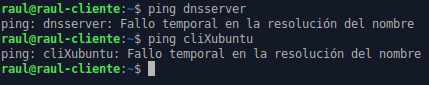
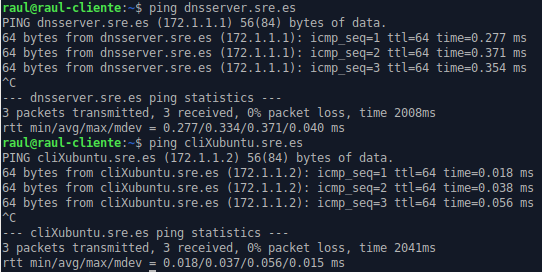
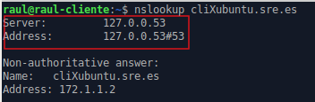
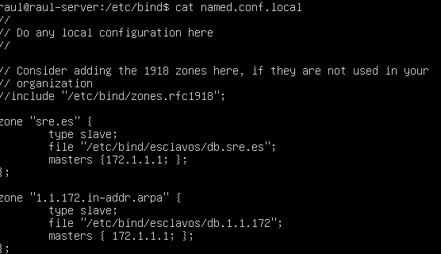
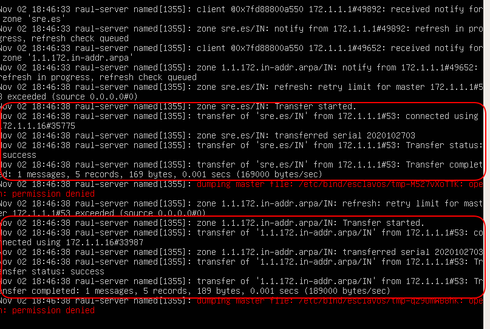

# Pràctica 3.2 - Configuració de servidor DNS mestre/esclau i millora de la configuració

!!!danger "Atenció, molt important abans de començar!"

    ✔ Heu de tenir un clon de l'Ubuntu Server, perquè faci de servidor DNS esclau
    
    ✔ Aquest servidor esclau tindrà una interfície a la nostra xarxa interna que rebrà la IP per DHCP així que:
        
    * Aquesta interfície, estarà configurada per a la mateixa xarxa interna que el server original i haurà de tindre configurat en netplan que reba la IP per DHCP

    ✔ Heu de tenir configurat el servidor DHCP perquè assigni una dirección IP fixa a l'Ubuntu Server.

    !!!info "Avís"

        ✔ Si ja havíeu clonat el servidor per fer les pràctiques de tema anterior,
        podeu reutilitzar-la però recordeu:

        * Aturar els servicis que tinguéssiu instal·lats (isc-dhcp-server, isc-dhcp-relay)

        * Cal desactivar-una de les interfícies en Virtualbox

        * La interfície de la xarxa interna estarà configurada per a la mateixa xarxa interna que el server original i haurà de tenir configurat en netplan que rebi la IP per DHCP

        * Instal·lar Bind i els paquets addicionals, tal com vam fer en la pràctica anterior al servidor original 

!!!Warning "Nota important"
    Si després de configurar-ho tot en la pràctica, no ixen els resultats que deuen, pot passar que s'hagi quedat informació guardada en la caché del client o del server. Per esborrar-les en el client:
    
    ```shell
    sudo systemd-resolve --flush-caches
    ```

    I en el servidor:
    
    ```shell
    sudo rndc flush
    sudo rndc reload
    ```


## Millora de la configuració del servidor

### Pas 1 – Afegir subdomini automàticament

Si proveu, amb la configuració de la pràctica anterior cal incloure el subdomini al nom de host per poder fer ping i que el DNS resolgui bé les direccions.

Així no funciona:



Així hauria de funcionar:



Podem solucionar això. Hem d'enviar la nostra direcció de domini als hosts per que la afegeixin a la seva IP quan se la assigni el DHCP.
Per això heu d'utilitzar, dins de la declaració de la vostra subnet a l'arxiu de configuració de l'DHCP, la directiva "option domain sre.es".

### Pas 2 – Afegir el nostre servidor DNS com a únic en el client

Si us heu fixat en la sortida de dig o de nslookup des del client, quan us diu que servidor DNS ha utilitzat per a la consulta, us posa que ha estat el 127.0.0.53



Aquesta adreça és l'adreça local de la vostra màquina client. Això és així perquè systemd, el “nou” sistema de gestió de servicis de Linux, té una espècie de servidor DNS local que és el primer que es consulta i si no té la resposta, la reenvía al servidor DNS que hàgim configurat.

Això és una falla coneguda de systemd i n'hi ha una espècie de “arranjament” per solucionar-ho i és crear un link simbòlic:

```shell
$ sudo rm -f /etc/resolv.conf
$ sudo ln -s /run/systemd/resolve/resolv.conf /etc/resolv.conf
```
I heu de reaplicar la configuració de xarxa:

```shell
sudo netplan apply
```
!!!question "Tasca"
    Feu una nova consulta en dig i comproveu que ara sí ha utilitzat el servidor que deu, és a dir, l'Ubuntu Server que heu configurat vosaltres. Adjunteu captures de pantalla de la configuració i el resultat.

### Pas 3 – Afegir forwarders

!!!question "Tasca"
    Comproveu que si feu una consulta a una adreça de domini d'Internet (cisco.com, github.com…), el domini sí es resol perfectament. Com és això possible si només hem configurat les zones autoritatives del DNS i cap més? A quins servidors DNS creieu que consulta el nostre Bind?

!!!question "Tasca"
    Descomenta en l'arxiu la secció de forwarders i afegeix les següents adreces.
    ```yaml
      forwarders {
                208.67.222.222; //Servidor DNS d'Opendns
                1.1.1.1; //Servidor DNS de  Cloudflare	
         };
    ```

!!!question "Tasca"
    Fes un dig a una adreça d'Internet una vegada més. Què creus que hem fet afegint aquestes adreces?

!!!question "Tasca"
    Si en l'arxiu “named.conf.options” canvieu la línia “recursion yes;” per “recursion no;”

      + Segueix funcionant la resolució de subdominis externs d'Internet (comprova-ho amb dig o nslookup)? 
      + I els propis (comprova-ho amb dig i amb el nom de domini complet de les màquines .sre.es)?
      + Per què passa això si tenim els forwarders configurats?

!!!info "Nota"
    Pot passar que no us funcionen de primeres. En aquest cas, i en el mateix arxiu, proveu a canviar la línia:

    ```yaml
    dnssec-validation auto;
    ```
    Per:

    ```yaml
    dnssec-enable yes;
    dnssec-validation yes;
    ```

### Pas 4 - Afegir arxius de log

Històricament tots els servicis de Linux han tingut el que es coneixen com a arxius de logs. Aquests arxius contenen text i registren tota l'activitat del servici, és a dir, tot el que ocorre amb ell. 

Hui dia això ho controla systemd i podem veure l'estat i l'activitat del servici amb el comando ```sudo journalctl -u nom_de el_servici```.
No obstant això, anem a afegir els nostres propis arxius de logs per fer-ho més accessible i manejable.

Per a això, en l'arxiu “named.conf” l'indiquem que ha de tenir en compte un nou arxiu de configuració que crearem després per especificar com guardar els logs:

```yaml
include "/etc/bind/named.conf.logging";
```
Hem de crear, ara sí, l'arxiu “named.conf.logging” amb el següent contingut:

```yaml hl_lines="8 16"
logging {
    channel errors_syslog {
          syslog daemon;
          severity warning;
        };
// Per loggear totes les consultes DNS al servidor
     channel queries_log {
          file "/var/log/named/queries.log" versions 600 size 20m;
          print-time yes;
          print-category yes;
          print-severity yes;
          severity dynamic;
        };
//Per loggear tots els errors en realitzar consultes al servidor
     channel query-errors_log {
          file "/var/log/named/query-errors.log" versions 5 size 20m;
          print-time yes;
          print-category yes;
          print-severity yes;
          severity dynamic;
        };
//Definim les categories associades als channels
        category lame-servers { null; };
        category edns-disabled { null; };
        category resolver { null; };
        category dnssec { errors_syslog; };
        category default { errors_syslog; default_debug; };
        category unmatched { null; };
        category queries { queries_log; };
        category query-errors { query-errors_log; };
};
```
Fixeu-vos en les parts destacades en groc. Li estem indicant que aquests van a ser els arxius de log on es bolcarà tota la informació corresponent. 

No obstant això, comproveu que aquest directori i aquests fitxers no existeixen.

* Creeu aquest directori amb aquests fitxers
* Després de fer-ho, heu de canviar la propietat de l'arxiu a l'usuari “bind”, que és el corresponent al servidor DNS:
  
  ```shell
  sudo chown bind.bind nom_de_fitxer
  ```

Finalment, a la configuració de Bind cal dir-li que sigui capaç de registrar la informació relativa a les queries o consultes DNS. Per a això modifiquem l'arxiu d'opcions “named.conf.options” i afegim, dins de “options {...}” la línia:

```yaml
querylog yes;
```
I reiniciem el servici de bind (named).

!!!question "Tasca"
    Comprova que realitzant ara consultes des del client, queden registrades en aquest arxiu i fes una captura de pantalla.


### Configuració del servidor esclau

Per configurar el servidor esclau, hem de tenir un clon de nostre servidor i realitzar els mateixos passos per instal·lar Bind.

Aquest servidor esclau serà capaç de resoldre les mateixes consultes que el principal, fins i tot serà capaç de seguir resolent consultes si el principal deixa de funcionar.

Així doncs, després d'instal·lar Bind de la mateixa forma que hem fet en el principal, configurem l'arxiu “named.conf.options” exactament de la mateixa manera també.
Per indicar-li a l'esclau que zones va a rebre, hem d'indicar-li que les mateixes que el mestre però en manera esclava. Quedaria així:



+ En la configuració posa que es guardaran les zones transferides en el directori “esclaus” dins del directori ```/etc/bind```, així que no oblideu crear aquest directori posat que no existeix. **Si vos dona error per qüestió de permisos, canvieu la ruta per a guardar les zones a ```/var/cache/bind/nom_de_zona```**
  
+ En el servidor DNS mestre, hem de, ara sí, indicar què zones i a qui anem a tranferirlas. S'utilitzaran aquestes línies de configuració:
  
  ```yaml
  allow-transfer { X.X.X.X };
  also-notify { X.X.X.X; };  
  ```

Aquestes línies teniu dues opcions, posar-les perquè actuïn per a cada zona de forma genèrica, en l'arxiu “named.conf.options”.

O podeu posar-la dins de cada zona en què vulguem transferir en el “named.conf.local”, tenint un major control sobre cadascuna d'elles.

En lloc de les X.X.X.X, heu de posar la IP del vostre servidor DNS esclau, que és a qui se li van a transferir les zones.


+ Finalment reinicia el servici de Bind del mestre i de l'esclau.


### Comprovació de la configuració

!!!Question "Tasca comprovació 1"
    + Usant el comando per monitorizar servicis 
      
      ```sh 
      journalctl -u nom_de_servici -f
      ```

      comprova que es produeix la transferència de zona en l'esclau. Hauries de veure alguna cosa com això:


    

    Aquí podeu veure com es produeixen les transferències de la zona de resolució directa i de la zona de resolució inversa.

!!!Question "Tasca comprovació 2"
        + Comprova que el servidor esclau funciona correctament i resol els noms de dnsserver i cliXubuntu, així com els de Internet. Pots usar qualsevol d'aquests dos comandos:

            ```sh
            dig nombre.sre.es @X.X.X.X → IP del servidor esclau
            nslookup nom X.X.X.X → IP del servidor esclau
            ```
            Indica en la captura de pantalla on comprovem efectivament que és el servidor esclau el que està resolent la consulta.

!!!Question "Tasca comprovació 3"
    + Comprova que tot funciona com ha de ser i apaga el servici “named” o “bind9” del servidor principal/mestre.

        El servidor esclau hauria de respondre sense problema a les consultes DNS.

      + Adjunta captures de pantalla dels comandos que utilitzis per fer les consultes DNS i indica en elles on podem veure que és el servidor esclau el que està resolent les consultes.
  
      +  Adjunta captura de pantalla dels logs, on es mostra que s'estan rebent consultes (queries).

!!! Warning "Atenció, nota"
    Recorda que perquè els clients usin un servidor DNS en cas de fallada d'un altre, aquesta informació l'ha d'enviar el servidor DHCP. Això és, el servidor DHCP haurà d'enviar-li les adreces IP de **tots dos** servidors DNS als clients.


## Questions finals

!!!Task "Questió 1"
    De quina altra forma, utilitzant un arxiu de configuració de Bind9, podem fer que el subdomini ***"sre.es"*** s'afegisca automàticament als noms de la zona, aconseguint lo mateix que en el **Pas 1**?

!!!Task "Questió 2"
    Explica detalladament què és un servidor mestre o principal i què és un esclau o secundari, així com la rel·lació que tenen.

!!!Task "Questió 3"
    Explica per a què serveixen aquestes línies i per què hem de posarles a l'arxiu de configuració corresponent:
        
    ```yaml
    allow-transfer { X.X.X.X };
    also-notify { X.X.X.X; };  
    ```
!!!Task "Questió 4"
    Com saben els clients què quan falla el server DNS principal, ha de començar a utilitzar el secondari?


## Avaluació

| Criteri      | Puntuació                         |
| :--------- | :----------------------------------: |
| Configuració correcta DHCP per a enviar subdomini i ^^comprovació^^       |**1  punts**  |
| Configuració correcta del servidor DNS com a únic en el client i ^^comprovació^^      | **0,5 punts** |
| Configuració correcta dels forwarders i resposta a les questions | **0,5 punts**|
| Configuració correcta dels logs i ^^comprovació^^ | **2 punts**|
| Configuració correcta del servidor esclau i ^^**totes** les comprovacions^^ | **3 punts**|
| Questions finals | **2 punts**|
| S'ha tingut cura amb el format del document, utilitzant la plantilla actualitzada i fent ús d'un correcte llenguatge tècnic |**1 punt** |


