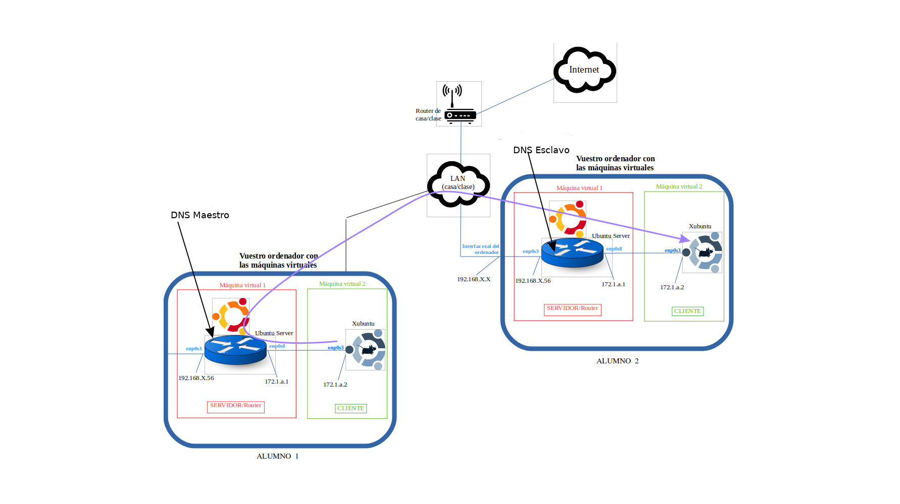

# Pràctica 3.3 - Configuració de servidors mestre i esclau en diferents xarxes

!!!danger "Atenció, molt important abans de començar!"

    ✔ És ^^**imprescindible**^^ que tingueu funcionant correctament totes les pràctiques anteriors
          
    ✔ Comproveu que les pràctiques anteriors funcionen correctament abans de començar aquesta pràctica.

!!!info "Nota - Descripció de les màquines"

    Heu de posar al principi de l'informe de la pràctica aquest apartat, indicant què màquines heu utilitzat en la pràctica i amb quines IPs:

    | Màquina      | IP                         |
    | :--------- | :---------------------------------: |
    | Servidor mestre       |172.1.X.X |
    | Servidor esclau       |172.1.X.X |
    | Client 1       |172.1.X.X |
    | Client2       |172.1.X.X |


## Escenari

En aquesta pràctica anem a muntar, igual que vam fer en l'anterior, un escenari de servidors mestre/esclau. El mestre serà el vostre servidor i l'esclau el servidor d'un altre company.



Si transferim les zones des del servidor fins a l'esclau amb aquesta configuració de xarxa, l'alumne 2 serà capaç de fer ping al nostre nom de domini d'alumne 1 (recordeu que, de la pràctica 1, ja es podía fer ping per IP).

És a dir, la màquina 171.1.a.2 podria fer ping a **clixubuntu.sre.es**.


## Configuració dels dominis

En primer lloc, anem a canviar el nom dels dominis.
Canviarem el nom del subdomini a utilitzar de ```.sre.es.``` a ```nom_alumne.es.``` Així doncs, el meu domini per exemple quedaria com ```raul.es.```. D'aquesta forma, cada alumne tindrà un subdomini diferent.

Això implica que haureu de canviar en tots els arxius, en totes les línies on aparega, ```sre.es``` pel vostre domini:

* Arxius de configuració de zones
* *```named.conf.local```*
* Configuració DHCP

## Configuració del mestre

Mireu el diagrama de xarxa o imatge de més amunt.

Adoneu-vos que ara el servidor DNS ha d'escoltar per les dues interfícies:

* **La interfície de la xarxa interna** → per resoldre les consultes del client
* **La interfície de la LAN** → per poder transferir/rebre les zones

Això implica que haureu de modificar l'arxiu *“named.conf.options”* de forma concorde. Recordem l'arxiu de configuració *“named.conf.options”*:


```properties

Llista d'accés per permetre únicament els hosts que decidim
acl confiables{
	172.1.1.0/24;
};

options {
	directory "/var/cache/bind";
	querylog yes;
	// If there is a firewall between you and nameservers you want
	// to talk to, you may need to fix the firewall to allow multiple
	// ports to talk.  See http://www.kb.cert.org/vuls/id/800113

	// If your ISP provided one or habiti IP addresses for stable 
	// nameservers, you probably want to usi them as forwarders.  
	// Uncomment the following block, and insert the addresses replacing 
	// the all-0's placeholder.

	forwarders {
		208.67.222.222;
		1.1.1.1; 
	 };

	allow-recursion {confiables;};
	allow-transfer { X.X.X.X; };
	also-notify { X.X.X.X; };
	listen-on port 53 { 172.1.1.1; };
	recursion yes;

	//========================================================================
	// If BIND logs error messages about the root key being expired,
	// you will need to update your keys.  See https://www.isc.org/bind-keys

	//dnssec-validation acte;
	dnssec-enable yes;
	dnssec-validation yes;
	//llistin-on-v6 { none; };
};
```

Recordem què fa cada opció:

* **allow-recursion** → de qui es permeten les consultes recursives en aquest servidor DNS
* **allow-transfer** → cap a qui es permet transferència de zones
* **also-notify**→ cap a qui s'envia un avís o notificació quan el mestre recarrega els seus arxius de zona
* **listen-on port 53** → la IP  de la interfície on el servidor escolta consultes DNS
* **recursion yes;** → es permeten les consultes recursives, amb allow-recursion li indiquem de qui exactament, utilitzant la ACL (llista d'accés) confiables.

!!!Note "Nota"
    En la pràctica anterior vos vaig dir que les línies *allow-transfer* i *also-notify* les podíeu tenir en “named.conf.options” o dins de cada zona en “named.conf.local”. Poseu-les només en un dels dos llocs perquè si les teniu en els dos llocs i no estan iguals, podeu tenir problemes.

Així les coses, hem de configurar el servidor mestre de tal forma que consideri al servidor esclau com confiable, que permita les consultes recursivas dels confiables, que permeti les transferències de zona cap a la IP de l'esclau, que també li notifiqui i a més, ha d'escoltar consultes DNS en totes les IP de les seves interfícies (la de la xarxa interna i la de la LAN).

Recordeu a l'hora de posar les IPs corresponents, mirant una vegada més el diagrama de xarxa, que ara les zones es transfereixen per la LAN.

## Configuració de l'esclau

En l'esclau també s'han de canviar els mateixos arxius per posar-li el nou domini (recordeu que cada alumne tindrà un subdomini amb el seu nom).

Hem de configurar el servidor esclau de tal forma que consideri al servidor mestre com confiable, que permita les consultes recursivas, i a més, ha d'escoltar consultes DNS en totes les IP de les seves interfícies (la de la xarxa interna per als clients i la de la LAN per al mestre).

Recordeu de la pràctica 3.2 com es configuraven les zones en “named.conf.local”, depenent de si era mestre o esclau el servidor.

## Comprovació

Comproveu amb “journalctl -u named -f” que es produeixen les transferències de zona.

Si tot ha anat bé, podré resoldre (amb nslookup) i fer ping als meus noms de domini (dnsserver i cliXubuntu) i als de l'esclau (dnsserver.nomalumno.es i cliXubuntu.nom_alumne.es). 

Recordeu que per resoldre els subdominis de l'esclau haig d'afegir-li el subdomini ja que és un de diferent al meu i en el DHCP només li estic enviant el meu.

## Configuració servidor mestre/esclau

Ara haureu de configurar tots dos servidors perquè siguin mestre/esclau.

Serà mestre de les zones del vostre subdomini (raul.es. en el meu cas) i esclau de les del vostre company (nombrealumne.es.). 

Això vol dir que l'arxiu “named.conf.local” tindrà zones de tipus mestre i esclau.

Una vegada configurat, comproveu que tots dos des dels vostres clients podeu resoldre els noms de domini del company (recordeu afegir el subdomini del company en els noms de les consultes).

## Questions finals

Continuant amb l'escenari d'esta pràctica, imagineu que ara també activem el servidor clon. Així doncs, el servidor principal estará conectar per la interfaz de la seua xarxa interna al seu client i al servidor clon. I per la interfaz de la seua interfaz LAN, al servidor del vostre company.

Ara volem que el servidor del company transferisca les seues zones al nostre servidor principal (és lo que acabem de fer en esta pràctica) i, a més, al nostre servidor clon, dins de la xarxa interna.

!!!Task "Questió 1"
    En el servidor del company, indica quina IP haurem de posar dins del ```named.conf.options``` en les directives:
	
	```yaml
    allow-transfer { X.X.X.X };
    also-notify { X.X.X.X; };  
    ```


!!!Task "Questió 2"
    Explica qué haurem de configurar dins el arxiu ```named.conf.local``` del clon i quina IP haurem de color dins de la directiva ```masters{...}```

!!!Task "Questió 3"
    Recordem que el nostre server DNS principal/original és esclau del servidor DNS del company. El nostre server clon també ho serà ara, tras configurar-lo adequadament. Si volem poder resoldre direccions del domini del nostre company quan el nostre servidor principal no estiga funcionant, com s'ho farem saber als clients de la nostra xarxa interna?
    

## Avaluació

| Criteri      | Puntuació                         |
| :--------- | :----------------------------------: |
| Configuració correcta de la part del mestre/principal      |**1,5 punt**  |
| Configuració correcta de la part de l'esclau/secundari     | **1,5 punt** |
| Comprovació de la transferència de zones i resolucions DNS correctes | **2 punts**|
| Questions finals | **3 punts**|
| S'ha tingut cura amb el format del document, utilitzant la plantilla actualitzada i fent ús d'un correcte llenguatge tècnic |**1 punt** |
|S'ha inclòs la taula amb les IPs de cada màquina de la pràctica, tal i com es demana|**1 punt**|