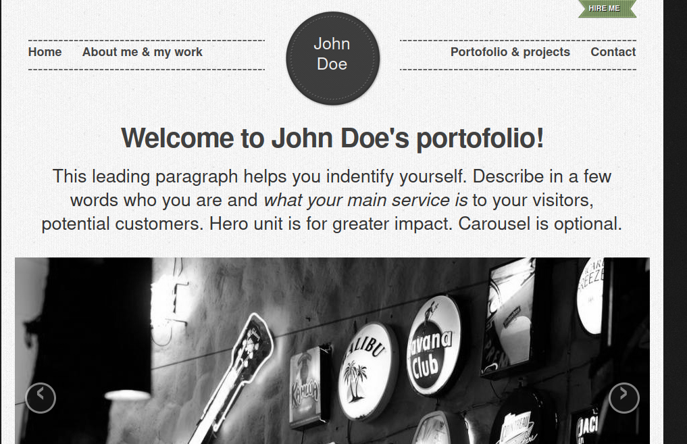
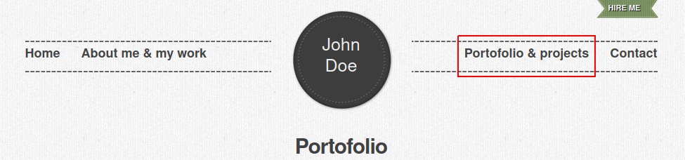
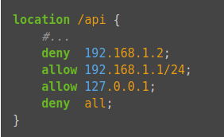

# Pràctica 4.2 – Autenticació en Nginx

## Requisits abans de començar la pràctica

!!!danger "Atenció, molt important abans de començar!"

    + La pràctica 4.1 ha d'estar funcionant correctament
    + No començar la pràctica abans de tenir la 4.1 ^^**funcionant i comprovada**^^

!!!info "Nota - Descripció de les màquines"

    Heu de posar al principi de l'informe de la pràctica aquest apartat, indicant què màquines heu utilitzat en la pràctica i amb quines IPs:

    | Màquina      | IP                         |
    | :--------- | :---------------------------------: |
    | Servidor web       |172.1.X.X |
    | Client       |172.1.X.X |
    | ...       |... |


## Introducció

En el context d'una transacció HTTP, l'autenticació **d'accés bàsica** és un mètode dissenyat per a permetre a un navegador web, o un altre programa client, proveir credencials en la forma d'usuari i contrasenya quan se les sol·licita una pàgina al servidor. 

L'autenticació bàsica, com el seu nom ho indica, és la forma més bàsica d'autenticació disponible per a les aplicacions Web. Va ser definida per primera vegada en l'especificació HTTP en si i no és de cap manera elegant, però compleix la seua funció. 

Aquest tipus d'autenticació és el tipus més simple disponible però emmalalteix d'importants problemes de seguretat que no la fan recomanable en moltes situacions. No requereix l'ús ni de cookies, ni d'identificadors de sessió, ni de pàgina d'ingrés. 

## Paquets necessaris

Per a aquesta pràctica podem utilitzar l'eina ^^openssl^^ per crear les contrasenyes.

En primer lloc hem de comprovar si el paquet està instal·lat:

```sh
dpkg -l | grep openssl
```

I si no ho estigués, instal·lar-lo.

## Creació d'usuaris i contrasenyes per a l'accés web

Crearem un arxiu ocult anomenat **.htpasswd** en el directori de configuració ```/etc/nginx``` on guardar els nostres usuaris i contrasenyes (la -c és per crear l'arxiu):

```sh
sudo sh -c "echo -n 'teu_nom:' >> /etc/nginx/.htpasswd"
```

Ara crearem un password xifrat per a l'usuari:

```sh
sudo sh -c "openssl passwd -apr1 >> /etc/nginx/.htpasswd"
```
Aquest procés es podrà repetir per a tants usuaris com calgui. 

+ Crea dos usuaris, un amb el teu nom i un altre amb el teu primer cognom.
+ Comprova que l'usuari i la contrasenya apareixen xifrats en el fitxer:

```sh
cat /etc/nginx/.htpasswd
```

## Configurant el servidor Nginx per usar autenticació bàsica

Editarem la configuració del server block sobre el qui volem aplicar la restricció d'accés. Utilitzarem per a aquesta autenticació el lloc web de John Doe: 

!!!info 
    Recorda que un server block és cadascun dels dominis ((```server {...}``` dins l'arxiu de configuració)) d'algun dels llocs webs que hi ha en el servidor



```sh
sudo nano /etc/nginx/sites-enabled/vostre_domini
```

Hem de decidir quins recursos estaran protegits. Nginx permet afegir restriccions a nivell de servidor o en un location (directori o arxiu) específic. Per al nostre exemple, protegirem el document root (l'arrel, la pàgina principal) del nostre lloc.

Utilitzarem la directiva ```auth_basic``` dins del location i li posarem el text que serà mostrat a l'usuari en sol·licitar les credencials. Finalment, configurem Nginx perquè utilitze el fitxer que prèviament hem creat amb la directiva ```auth_basic_user_file```:

```yaml hl_lines="11 12"
server {
        listen 80;
        listen [::]:80;

        root /var/www/vostre_domini/html/retro-doe;
        index index.html index.htm index.nginx-debian.html;

        server_name vostre_domini www.vostre_domini;

        location / {
		auth_basic	"Àrea restringida";
		auth_basic_user_file 	/etc/nginx/.htpasswd;
            try_files $uri $uri/ =404;
        }
}
```
Una vegada acabada la configuració, reiniciem el servei perquè apliqui la nostra política d'accés.

```sh
sudo systemctl restart nginx
```

## Provant la nova configuració

!!!Question "Comprovació 1"
    Comprova des del teu client Xubuntu que en accedir a http://vostre_domini o http://www.vostre_domini se't sol·licita una autenticació.

!!!Question "Comprovació 2"
    Comprova que si decideixes cancel·lar l'autenticació, se't negarà l'accés al lloc amb un error. Quin error és?

### Tasques

!!!Question "Tasca 1"
    + Intenta entrar primer amb un usuari erroni i després amb un altre correcte. Pots veure tots els successos i registres en els logs access.log i error.log. 

    + Adjunta una captura de pantalla dels logs on es vegi que intentes entrar primer amb un usuari invàlid i amb un altre vàlid. Indica on podem veure els errors d'usuari invàlid o no oposat, així com on podem veure el nombre d'error que us apareixia abans.

Quan hem configurat el següent bloc:

```yaml hl_lines="2 3"
location / {
		auth_basic	"Àrea restringida";
		auth_basic_user_file 	/etc/nginx/.htpasswd;
            try_files $uri $uri/ =404;
        }
```

L'autenticació s'aplica al directori/arxiu que li indiquem, en aquest cas l'arrel ```/```, que és:

```
/var/www/exemple1/html/retro-doe/
```

I a tots els arxius que hi ha dins, ja que no hem especificat cap.

Ara bé, anem a provar a aplicar autenticació només a una part de la web. Intentarem que només es necessite autenticacíó per a entrar a la part de portfolio:



Aquesta secció es correspon amb l'arxiu “portofolio.html” dins del directori arrel.

!!!Question "Tasca 2"
    Esborra les dues línies que fan referència a l'autenticació bàsica en el location del directori arrel. Després d'això, afegeix un nou location sota amb l'autenticació bàsica per a l'arxiu portofolio.html. 

!!!warning 
    Fixeu-vos que heu d'anar amb compte perquè l'última línia de l'arxiu ha de ser la ```}``` que tanca la primera línia ```server {``` de l'arxiu.


### Combinació de l'Autenticació Bàsica amb la restricció d'accés per IP

L'autenticació bàsica HTTP pot ser combinada de forma efectiva amb la restricció d'accés per adreça IP. Es poden implementar dos escenaris:

+ Un usuari ha d'estar ambdues coses, autenticat i tenir una IP vàlida
  
+ Un usuari deu o bé estar autenticat, o bé tenir una IP vàlida
  
Vegem com ho faríem:

1. Com permetre o denegar accés sobre una IP concreta (directives **allow** i **deny**, respectivament). Dins del block server o arxiu de configuració del domini web, que recordeu està en el directori sites-available:

    

    L'accés només es garantirà a la IP ```192.168.1.1/24```, excloent a l'adreça ```192.168.1.2```.

    Cal tenir en compte que les directives allow i deny s'aniran aplicant en l'ordre en el qual apareixen l'arxiu. 

    Ací apliquem sobre la ```location /api``` (es només un exemple), però podriem aplicar sobre qualsevol, inclòs tot el lloc web, la location arrel (/).

    L'última directiva ```deny all``` vol dir que per defecte denegarem l'accés a tothom. Per això cal posar els allow i deny més específics just abans d'aquesta, perquè en avaluar-se en ordre d'aparició, si els posàrem baix es denegaria l'accés a tothom, ja que ```deny all``` seria el primer que s'avaluaria.

2. Combinar la restricció IP i l'autenticació HTTP amb la directiva **satisfy**. 
   
    Si establim el valor de la directiva a ```all```, l'accés es permet si el client satisfà ambdues condicions (IP i usuari vàlid). Si ho establim a ```any```, l'accés es permet si se satisfà almenys una de les dues condicions.

    


## Tasques

!!!Question "Tasca 1" 
    Col·loca una altra vegada dos clients a la teva xarxa interna i ^^**assegura't que la seua configuració de xarxa és correcta**^^

!!!Question "Tasca 2"
    Configura Nginx perquè no deixi accedir amb la IP del client1 al directori arrel de la mateixa web d'abans, la de John Doe’s. Modifica el seu server block o arxiu de configuració. Comprova com es denega l'accés:

    + Mostra la pàgina d'error en el navegador
    + Mostra el missatge d'error d'error.log

!!!Question "Tasca 3"
    Configura Nginx per a que el client2 hagi de tenir tant una IP vàlida com un usuari vàlid, ambdues coses alhora, i comprova que sí pot accedir sense problemes.


!!!Question "Tasca 4"
    Configura Nginx ara per a que deixe accedir si es té una IP vàlida o també si l'usuari introduït és correcte. Comprova que ara sí poden accedir tots dos clients, per què?


## Qüestions finals

!!!Task "Questió 1"
    Suposem que jo sóc el client amb la IP 172.1.10.15 i e intente accedir al directori “/web_molt_guay” del
    meu lloc web, equivocant-me al posar usuari i contrasenya. Podré accedir?

    ```yaml
        location /web_molt_guay {
        #...
        satisfy all;    
        deny  172.1.10.6;
        allow 172.1.10.15;
        allow 172.1.3.14;
        deny  all;
        auth_basic "Questió final 1";
        auth_basic_user_file conf/htpasswd;
    }
    ```

!!!Task "Questió 2"
    Suposem que jo sóc el client amb la IP 172.1.10.15 i e intente accedir al directori “/web_molt_guay” del
    meu lloc web, introduïnt correctament usuari i contrasenya. Podré accedir?  

    ```yaml
        location /web_molt_guay {
        #...
        satisfy all;    
        deny  all;
        deny  172.1.10.6;
        allow 172.1.10.15;
        allow 172.1.3.14;
        
        auth_basic "Questió final 2: The revenge";
        auth_basic_user_file conf/htpasswd;
    }
    ```

!!!Task "Questió 3"
    Suposem que jo sóc el client amb la IP 172.1.10.15 i e intente accedir al directori “/web_molt_guay” del
    meu lloc web, introduïnt correctament usuari i contrasenya. Podré accedir?

    ```yaml
        location /web_molt_guay {
        #...
        satisfy any;    
        deny  172.1.10.6;
        deny 172.1.10.15;
        allow 172.1.3.14;
        
        auth_basic           "Questió final 3: The final combat";
        auth_basic_user_file conf/htpasswd;
    }
    ```

!!!Task "Questió 4"
    A lo millor no sabeu que tinc una web per a documentar totes les meues excursions a l’espai amb Jeff Bezos, és aquesta: [Jeff Bezos i jo](https://freewebsitetemplates.com/preview/space-science/index.html)

    Suposem que vull restringir l’accés al directori de projectes perquè es molt secret, això vol dir afegir autenticació bàsica a la URL: [Projectes](https://freewebsitetemplates.com/preview/space-science/projects.html)

    Completa la configuració per a aconseguir-ho:
    
    ```yaml hl_lines="7 8"
        server {
            listen 80;
            listen [::]:80;
            root /var/www/freewebsitetemplates.com/preview/space-science;
            index index.html index.htm index.nginx-debian.html;
            server_name freewebsitetemplates.com www.freewebsitetemplates.com;
            location              {
            
                try_files $uri $uri/ =404;
            }
        }
    ```

## Avaluació

| Criteri      | Puntuació                         |
| :--------- | :----------------------------------: |
|  Configuració correcta de l'autorització bàsica d'Nginx, comprovació i identificació de l'error   |**2 punts**  |
|  Captures correctes del log | **0.5 punt** |
| Configuració correcta de l'autorització bàsica al "portofolio"| **2 punts**|
| Correcta configuració i comprovació de les tasques d'autenticació bàsica i restricció per IP | **3 punts**|
|Qüestions finals|**1 punt**|
| S'ha tingut cura amb el format del document, utilitzant la plantilla actualitzada i fent ús d'un correcte llenguatge tècnic |**1 punt** |
|S'ha inclòs la taula amb les IPs de cada màquina de la pràctica, tal i com es demana|**0.5 punt**|


