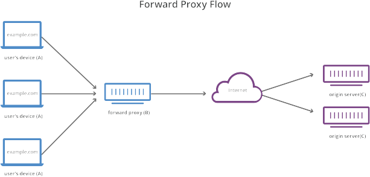
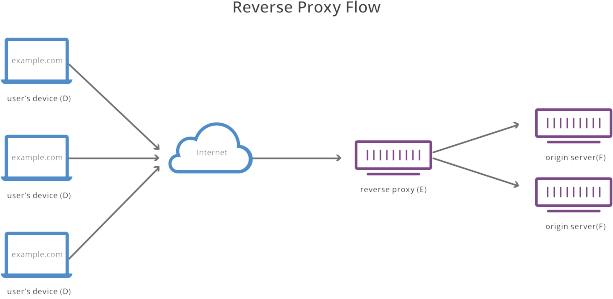
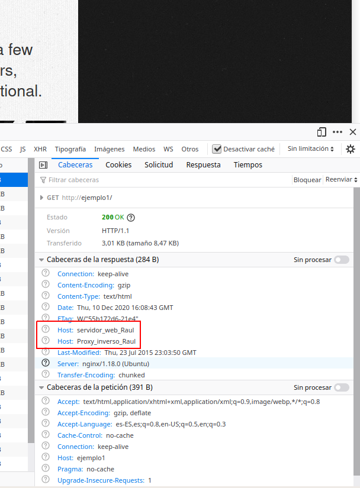

# Pràctica 4.3 – Proxy invers amb Nginx

## Requisits abans de començar la pràctica

!!!danger "Atenció, molt important abans de començar!"

    + La pràctica 4.1 ha d'estar funcionant correctament
    + No començar la pràctica abans de tenir la 4.1 ^^**funcionant i comprovada**^^

!!!info "Nota - Descripció de les màquines"

    Heu de posar al principi de l'informe de la pràctica aquest apartat, indicant què màquines heu utilitzat en la pràctica i amb quines IPs:

    | Màquina      | IP                         |
    | :--------- | :---------------------------------: |
    | Servidor web       |172.1.X.X |
    |Proxy invers|172.1.X.X|
    | Client       |172.1.X.X |
    | ...       |... |


## Introducció
### Què és un servidor proxy?

Un proxy de reexpedició, sovint anomenat proxy, servidor proxy o proxy web, és un servidor que es troba enfront d'un grup de màquines client. Quan aquestes màquines realitzen sol·licituds a llocs i servicis en Internet, el servidor proxy intercepta aquestes sol·licituds i després es comunica amb els servidors web en nom d'aquests clients, com un intermediari.

Per exemple, prenguem com a exemple 3 màquines involucrades en una comunicació típica de proxy de reenviament:

+ A: Aquesta és la màquina de la casa d'un usuari.
+ B: Este és un servidor proxy de reenviament
+ C: Este és el servidor d'origen d'un lloc web (on s'emmagatzemen les dades de l'lloc web)
  


En una comunicació estàndard per Internet, la màquina A se comunicaria directament amb la màquina C, amb el client enviant sol·licituds al servidor d'origen i el servidor d'origen responent al client. 

Quan n'hi ha un proxy de reenviament, A enviarà sol·licituds a B, que després reexpedirà la sol·licitud a C. C enviarà una resposta a B, que reexpedirà la resposta a A.

Per què agregar aquest intermediari addicional a la nostra activitat en Internet? Hi ha algunes raons per les quals un podria voler usar un proxy de reenviament:

+ ^^**Per evitar restriccions de navegació estatals o institucionals:**^^ alguns governs, escoles i altres organitzacions usen firewalls per donar als seus usuaris accés a una versió limitada d'Internet. Es pot usar un proxy de reenviament per sortejar aquestes restriccions, ja que permeten que l'usuari es connecti al proxy en lloc de directament als llocs que està visitant.

+ ^^**Per bloquejar l'accés a cert contingut:**^^ al revés, els proxies també es poden configurar per bloquejar l'accés d'un grup d'usuaris a certs llocs. Per exemple, una xarxa escolar pot estar configurada per connectar-se a la web a través d'un proxy que habilita regles de filtrat de contingut, negant-se a reexpedir respostes de Facebook i altres llocs de xarxes socials.

+ ^^**Per protegir la seva identitat en línia:**^^ en alguns casos, els usuaris habituals d'Internet simplement desitgen un major anonimat en línia, però en altres casos, els usuaris d'Internet viuen en llocs on el govern pot imposar greus conseqüències als dissidents polítics. Criticar al govern en un fòrum web o a les xarxes socials pot donar lloc a multes o empresonament per a aquests usuaris. Si un d'aquests dissidents usa un proxy de reenviament per connectar-se a un lloc web on publica comentaris políticament sensibles, l'adreça IP utilitzada per publicar els comentaris serà més difícil de rastrejar fins al dissident. Solament estarà visible l'adreça IP del servidor proxy.

### En què es diferencia un proxy invers?

Estaríem parlant del cas oposat a l'anterior. 

Un proxy invers és un servidor que es troba enfront d'un o més servidors web, interceptant les sol·licituds dels clients. Això és diferent d'un proxy de reenviament, on el proxy es troba enfront dels clients. Amb un proxy invers, quan els clients envien sol·licituds al servidor d'un lloc web, aquestes sol·licituds són interceptades a la frontera de la xarxa pel servidor proxy invers. El servidor proxy invers enviarà sol·licituds i rebrà respostes del servidor de lloc web.

La diferència entre un proxy directe i invers és subtil però important. Una forma simplificada de resumir seria dir que un proxy de reenviament es troba enfront d'un client i garanteix que cap servidor d'origen es comuniqui mai directament amb aquest client específic. 

D'altra banda, un proxy invers es troba enfront d'un servidor d'origen i garanteix que cap client es comuniqui mai directament amb aquest servidor d'origen.

Una vegada més, il·lustrem nomenant les màquines involucrades:

+ D: qualsevol nombre d'ordinadors domèstics dels usuaris
+ I: est és un servidor proxy invers
+ F: un o més servidors d'origen



Normalment, totes les sol·licituds de D anirien directament a F, i F enviaria respostes directament a D. Amb un proxy invers, totes les sol·licituds de D aniran directament a I, i I enviarà les seves sol·licituds ai rebrà respostes de F. I després transmeti les respostes apropiades a D.

A continuació es descriuen alguns dels beneficis d'un proxy invers:

+ ^^**Balanceig de càrrega:**^^ és possible que un lloc web popular que rep milions d'usuaris tots els dies no pugui manejar tot el tràfic entrant del lloc amb un sol servidor d'origen. En canvi, el lloc es pot distribuir entre un grup de servidors diferents, tots manejant sol·licituds per al mateix lloc. En aquest cas, un proxy invers pot proporcionar una solució de balanceig de càrrega que distribuirà el tràfic entrant de manera uniforme entre els diferents servidors per evitar que un sol servidor se sobrecarregui. En el cas que un servidor falli per complet, altres servidors poden intensificar per manejar el tràfic.

+ ^^**Protecció contra atacs:**^^ amb un proxy invers en el seu lloc, un lloc web o servici mai necessita revelar l'adreça IP de la seva (s) servidor (és) d'origen. Això fa que sigui molt més difícil per als atacants aprofitar un atac dirigit contra ells, com un atac DdoS.

+ ^^**Emmagatzematge en caché**^^: un proxy invers també pot emmagatzemar contingut en caché , la qual cosa resulta en un rendiment més ràpid. Per exemple, si un usuari a París visita un lloc web amb proxy invers amb servidors web a Los Angeles, l'usuari podria connectar-se a un servidor proxy invers local a París, que després haurà de comunicar-se amb un servidor d'origen a Los Angeles. El servidor proxy després pot emmagatzemar en caché (o guardar temporalment) les dades de resposta. Els usuaris parisencs posteriors que naveguin pel lloc obtindran la versió en caché local del servidor proxy invers parisenc, la qual cosa donarà com resultat un rendiment molt més ràpid.

+ ^^**Xifrat SSL**^^- Xifrat i desxifrat SSL (o TLS comunicacions) per a cada client poden ser computacionalment car per a un servidor d'origen. Es pot configurar un proxy invers per desxifrar totes les sol·licituds entrants i xifrar totes les respostes sortints, alliberant valuosos recursos en el servidor d'origen.

## Tasca

Anem a configurar dos Ubuntu Server amb sengles servidors Nginx:

+ Un servirà les pàgines web que ja hem configurat, així doncs utilitzarem el servidor que ja tenim configurat de la Pràctica 4.1.
+ Un altre servidor clon Ubuntu Server amb tots els servicis parats a excepció de Nginx configurat com proxy invers → Ha de tenir IP fixa en el DHCP
+ Realitzarem les peticions HTTP des del navegador web del nostre Xubuntu.

El diagrama de xarxa quedaria així:


Les tres màquines estaran a la nostra xarxa interna. Farem les peticions web al servidor proxy, que les redirigirà al nostre servidor web Nginx original. Aquest últim respondrà al proxy invers, que ens redirigirà la resposta al nostre client Xubuntu.
Hem dit que un proxy invers és un servidor intermediari que hauria de ser invisible en la mesura del possible. Anem a veure què configuracions necessitem fer per aconseguir-ho.

### Configuracions

#### Nginx servidor web

Per a que tot quede més diferenciat i vos quede més clar que la petició està passant pel proxy invers i arriba al servidor web destí, anem a fer que cadascun dels servidors escolti les peticions en un port diferent.

  1. En primer lloc, heu de canviar el nom que tingués vostra web pel de “webserver”:
      1. Canviar el nom de l'arxiu de configuració
      2. Canviar el nom de l'lloc web dins d'aquest arxiu de configuració on faci mancada
      3. No us oblideu d'eliminar el link simbòlic antic  amb el comando “unlink nom_de el_link” i crear el nou per al nou nom d'arxiu.
  2. En l'arxiu de configuració de l'lloc web, en lloc de fer que el servidor escolti en el port 80, canvieu-ho al 8080.
  3. Canviar el registre  CNAME del DNS (ara l'àlies no serà el nom antic de la vostra web, sinó el nou nom que hem posat, “webserver”)
  4. Reiniciar Nginx

#### Nginx proxy invers

Ara, quan intentem accedir a http://jugador (o el nom que tingau de la vostra web), en realitat estarem accedint al proxy, que ens redirigirà a http://webserver:8080, el servidor web que acabem de configurar perquè escolti amb aquest nom en el port 8080.

Per a això:

   1. Crear un arxiu de configuració en sites-available amb el nom jugador (o el que tinguéreu vosaltres)
   2. Aquest arxiu de configuració serà més simple, tindrà la següent forma

    ```yaml hl_lines="2 3 5"
    server {
            listen __;
            server_name ____________;
            location / {
            proxy_pass http://_________:____;
            }
    }
    ```
     On, ^^***mirant el diagrama de xarxa i tenint en compte la configuració feta fins ara***^^, heu de completar:

      + El port on està escoltant el proxy invers
  
      + El nom de domini o lloc web al que accedim en el proxy
  
      + La directiva “proxy_pass” indica a on es van a redirigir les peticions, això és, al servidor web. Per tant, heu de posar el nou nom i nombre de port adequats de vostre lloc web configurat en l'apartat anterior.
  
  3. Crear el link simbòlic pertinent
   
  4. Heu de crear dos registres nous en el DNS:
   
      + Un de tipus ```A```, el nom del qual serà ```proxy-server.nom_alumne.es.``` i que apunta a la IP d'aquest segon servidor proxy invers
  
      + Un altre registre tipus ```CNAME```, de tal forma que jugador (o el nom de vostre lloc web) anotació al registre tipus A creat en el punt anterior. 
  
    Això és per simular la situació en la qual nosaltres, com a clients, quan accedim a nostre lloc web, no necessitem saber com està tot configurat, només necessitem saber el nom de la web. 

    No obstant això, per identificar les màquines internament, nosaltres com a administradors les tindrem identificades amb altres noms (proxy-server i webserver/dnsserver).

## Comprovacions

Si accediu a vostre lloc web, heu de poder seguir accedint sense problemes.

+ Comproveu en els access.log dels dos servidors que arriba la petició
  
+ Comproveu a més la petició i resposta amb les eines de desenvolupador de Firefox en Xubuntu. Prement F12 en el navegador us apareixeran aquestes eines:


En la primera petició (marcada en vermell), utilitzant l'apartat “Xarxa” (també marcat en vermell) i també en vermell està assenyalat on es pot veure la resposta de la petició GET HTTP (200 OK). 

També veiem les capçaleres que s'inclouen en la petició (mètode GET) i en la resposta a aquesta petició.

### Afegint capçaleres

A més d'haver mirat els logs, anem a demostrar encara de forma més clara que la petició està passant pel proxy invers i que està arribant al servidor web i que torna pel mateix camí.

Si recordeu de teoria, el servidor web és capaç d'afegir capçaleres en les respostes a les peticions. 
Així doncs, anem a configurar tant el proxy invers com el servidor web perquè afegeixin cadascun la capçalera “Host” que també vam veure en teoria. 

Per afegir capçaleres, en l'arxiu de configuració de l'lloc web hem d'afegir dins del bloc ```location / { … }``` hem d'afegir la directiva:

```yaml
add_header Host “nom_del_host”
```

1. Afegirem primer aquesta capçalera únicament en l'arxiu de configuració de l'lloc web del proxy invers. El Nom_del_host serà Proxy_invers_vostrenom. 
2. Reiniciem Nginx
3. Comprovem que podem accedir a l'lloc web sense problemes
4. Amb les eines de desenvolupador comprovem que la petició ha passat pel proxy invers que ha afegit la capçalera en la resposta:

    

5. Fem el propi amb el servidor web. Aquesta vegada el ```nom_del_host``` serà ```servidor_web_vostrenom```.
    
    Si tot està configurat correctament, en examinar les peticions i respostes, us apareixeran les dues capçaleres que han inclòs en la resposta tant el proxy invers com el servidor web.

    

És **molt important** que per realitzar aquestes comprovacions tingueu marcat el checkbox “Desactivar caché”. 


Si no marqueu això, la pàgina es guardarà en la memòria caché del navegador i no estareu rebent la resposta del servidor sinó de la caché del navegador, la qual cosa pot donar lloc a resultats erronis.

## Avaluació

| Criteri      | Puntuació                         |
| :--------- | :----------------------------------: |
|  Configuració correcta i completa del servidor web   |**3.5 punts**  |
|  Configuració correcta i completa del proxy invers| **3.5 punts** |
| Comprovació del correcte funcionament, incloent les capçaleres| **1.5 punts**|
| S'ha tingut cura amb el format del document, utilitzant la plantilla actualitzada i fent ús d'un correcte llenguatge tècnic |**1 punt** |
| S'ha inclòs la taula amb les IPs de cada màquina de la pràctica, tal i com es demana|**0.5 punt**|


