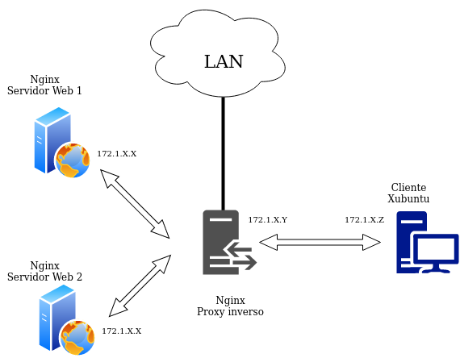
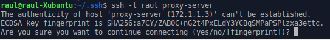
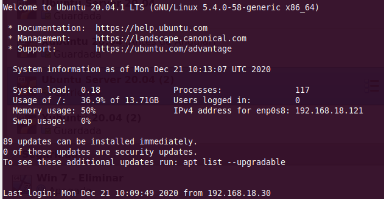
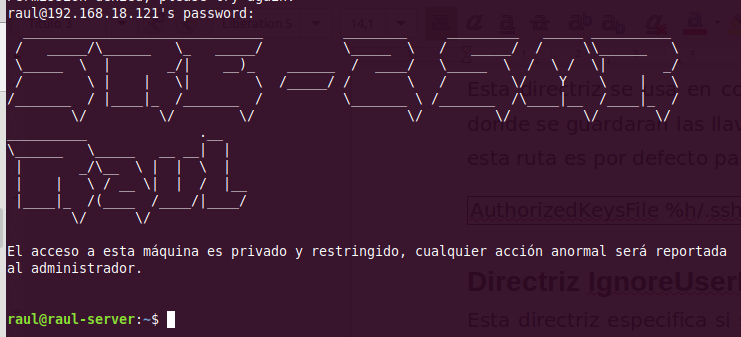
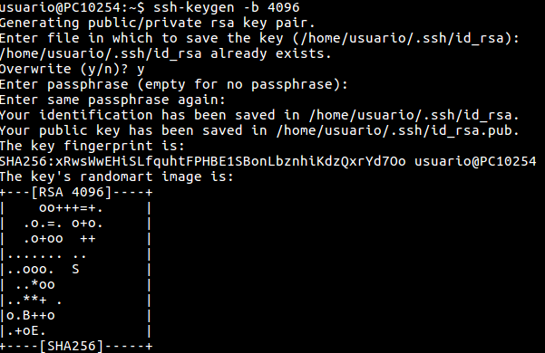
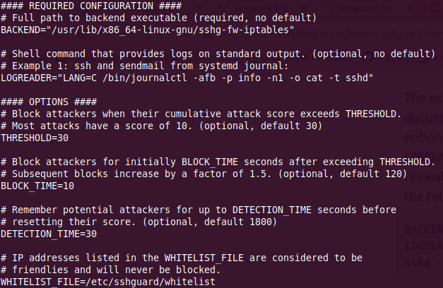

# Practica 5.1 - Instal·lació i hardening (bastionat) de servici SSH

## Requisits abans de començar la pràctica

!!!danger "Atenció, molt important abans de començar!"

    + Treballarem sobre l'escenari que ens va quedar al final del tema 4, que si recordeu era un proxy invers i dos servidors web
    + Configurarem el servidor SSH en el proxy invers

!!!info "Nota - Descripció de les màquines"

    Heu de posar al principi de l'informe de la pràctica aquest apartat, indicant què màquines heu utilitzat en la pràctica i amb quines IPs:

    | Màquina      |    IP     |
    | :----------- | :-------: |
    | Client SSH   | 172.1.X.X |
    | Servidor SSH | 172.1.X.X |
    | ...          |    ...    |

## Introducció

Aprendrem a instal·lar i a configurar un servici SSH per poder connectar-nos de forma remota. 

El primer serà configurar una interfície addicional en aquest proxy invers. Serà un adaptador de xarxa tipus pont o bridge. Això ens proporcionarà el següent escenari:



Quan tot estiga ben configurat, podrem connectar-nos via SSH tant des del client Xubuntu com des de la vostra màquina host o física. Això us proporcionarà l'avantatge de poder iniciar el proxy invers amb VirtualBox en format sense pantalla, connectar-vos via SSH i fer les pràctiques directament des del terminal de Lliurex. Això té avantatges com que deixarà copiar i pegar sense problemes.

## Instal·lació i configuració de OpenSSH
### Instal·lació
Per instal·lar el nostre servidor SSH no tenim més que:

```sh
sudo apt install openssh-server
```

Per comprovar l'estat del servici:
```sh
systemctl status ssh
```

Linux ja ve amb un client SSH preinstal·lat, per la qual cosa no seria necessària major configuració en el client. Ja hauríeu de poder connectar-vos de forma remota al proxy invers amb el següent comando:
```sh
ssh nom_usuari_proxy@IP_proxy
```

1. Proveu que podeu connectar-vos des del client Xubuntu usant òbviament la IP de la interfície de la xarxa interna del proxy
  
2. Proveu a connectar-vos per la interfície de la LAN del proxy utilitzant el vostre ordinador de classe o de casa (en estar en adaptador pont, estareu a la mateixa xarxa vosaltres i la màquina virtual)
    - Per connectar-vos des d'un ordinador amb Windows haureu d'instal·lar-vos un client SSH com Putty: 
    [Client Windows](https://www.aemilius.net/ayuda/articulos/acceso-ssh-ssl-secure-shell-telnet-putty.html)

La primera vegada que us connecteu, us apareixerà alguna cosa com això:



Se'ns està informant que l'equip al que ens estem connectant per SSH podria no ser el nostre o el que pensem que és. Per estar 100% segurs, caldria anar al proxy-server, comprovar la seua “petjada” (fingerprint) que ho identifica i comparar-la amb la qual aquí se'ns mostra.

Atès que això és una pràctica acadèmica, que el nostre escenari és molt senzill i podem estar segurs que el proxy-server és la nostra màquina, simplement li direm “yes” i continuarem la connexió.

Aquesta acció afegirà al proxy-server a l'arxiu **known_hosts**.

### Quins arxius de configuració tinc?

1. ```/etc/ssh/sshd_config```: Arxiu principal de configuració del servidor SSH (configura el dimoni o servici).

2. ```/etc/ssh/ssh_config```: Arxiu principal de configuració dels clients SSH. 

3. ```/.ssh/config```: Arxiu personal de cada usuari. 
    Conté la configuració utilitzada pels clients SSH. Permet a l'usuari local utilitzar una configuració diferent a la definida en l'arxiu /etc/ssh/ssh_config. 

5. ```/.ssh/known_hosts```: Arxiu personal de cada usuari. Conté les signatures digitals dels servidors SSH als quals es connecten els clients. Quan aquestes signatures canvien, es poden actualitzar executant el comando ssh-keygen -R, passant el nom de l'amfitrió o la IP de l'amfitrió com a argument. Aquest comando elimina l'entrada corresponent en l'arxiu /.ssh/known_hosts i, permet afegir de nou a l'amfitrió amb una nova signatura digital.

6. ```/.ssh/authorized_keys```: Arxiu personal per a cada usuari. Conté els certificats dels clients SSH, per permetre autenticació cap a servidors SSH sense requerir contrasenya. 

### Principals directrius de la configuració

Quan parlem de fer hardening d'un servici, ho podríem traduir com a fortificació o bastionat. És a dir, es configura un servici de tal manera que es protegeix el màxim possible de qualsevol fallada o atac a aquest servici.

Després de la instal·lació procedirem a la configuració del servidor, per a això, editarem el fitxer de configuració ```/etc/ssh/sshd_config```.

Vegem detalladament les directrius que poden aparèixer en aquest arxiu:

#### Directriu Port
De forma predeterminada, el servici SSH escolta pel port 22. La directriu per defecte seria:

```Port 22```

Una forma d'elevar la seguretat del servidor SSH, consisteix a canviar el nombre de port predeterminat per un altre que només l'administrador del sistema conegui. A aquest tipus de tècniques se'ls coneix com a [seguretat per foscor](https://es.wikipedia.org/wiki/Seguridad_por_oscuridad). Encara que no es considera ni recomanable ni suficient.

Els atacants buscaran servidors que estiguin escoltant pel port 22. Canviar de port disminueix considerablement la possibilitat d'una intrusió. 

#### Directriu ListenAddress

De forma predeterminada, el servici SSH escoltarà peticions a través de totes les adrecis IP corresponents a totes les interfícies de xarxa del sistema. La directriu per defecte seria:

```ListenAddress 0.0.0.0```

Es pot configurar perquè només escolti per una de les interfícies.

#### Directriu Protocol
Permet indicar què versió del protocol utilitzar. Ja vam dir que la versió segura avui dia és la 2:

```Protocol 2```

#### Directriu LoginGraceTime
En aquesta directriu s'estableix el temps, en segons, durant el qual la pantalla de login estarà disponible perquè l'usuari introdueixi el seu nom d'usuari i contrasenya, si no ho fa durant aquest període de temps el login es tancarà, evitant així deixar per temps indeterminat pantalles de login sense que ningú les usi, o que algú est intentant mitjançant un script endevinar un usuari i la seua contrasenya. 

Si el valor és 0, no hi ha límit de temps perquè un usuari s'autentiqui, la qual cosa no és recomanable ja que d'aquesta forma un atacant podria utilitzar atacs de força bruta o usant mètodes de diccionari per endevinar la contrasenya, per tant no és recomanable deixar aquesta directriu a 0. 

#### Directriu PermitRootLogin
Probablement sigui la directriu de seguretat més important que podem establir per assegurar el nostre servidor SSH. En els sistemes Unix i Linux es crea per defecte a l'usuari root, amb privilegis de adnimistrador. 

Molts atacs de força bruta es concentren a atacar a l'usuari root amb l'esperança que tingui una contrasenya feble. Sabent una part de l'equació (root) solament serà qüestió de temps perquè algú amb paciència i sort vulneri el sistema. En aquesta directriu deneguem l'accés a l'usuari root i per tant, qualsevol intent d'atac directe a l'usuari root serà inútil.

En denegar l'accés a l'usuari root, cada vegada que necessitem realitzar tasques administratives, accedirem com un usuari normal i una vegada dins, utilitzant algun dels comandos el seu o sudopodrem realitzar aquestes tasques administratives. Per tant, denegant l'accés a l'usuari root, l'atacant haurà d'encertar tant el nom d'un usuari del sistema com la seua contrasenya, alguna cosa que disminueix notablement la probabilitat d'una intrusió.

```PermitRootLogin yes/no```

#### Directriu StrictModes
En aquesta directriu s'estableix que **sshd (el servici ssh)** revisés els modes i permisos dels arxius dels usuaris i el directori $HOME de l'usuari abans d'acceptar la sessió.

Això és normalment desitjable perquè de vegades alguns usuaris deixen els seus directoris, accidentalment, amb permís d'escriptura per a qualsevol. El valor predeterminat és **yes**, per tant, ho deixarem amb el seu valor predeterminat.

```StrictModes yes/no```

#### Directriu MaxAuthTries
El valor d'aquesta directriu estableix el màxim nombre d'intents d'autenticació permesos per connexió, és a dir, la quantitat de vegades que podem equivocar-nos en ingressar l'usuari i/o contrasenya. Una vegada que els intents aconsegueixen la meitat d'aquest valor, les connexions fallides següents seran registrades. 

Després del màxim nombre d'intents es tancarà la connexió. És possible tornar a intentar-ho, però el límit d'intents per vegada evita atacs basats en la persistència de la connexió.

```MaxAuthTries 5```

#### Directriu MaxStartups
El valor d'aquesta directriu estableix el màxim nombre de connexions simultaneges de login que permetrà el **servidor SSH** per cada **IP** que intenti connectar-se. 

Hi ha atacs molt efectius que divideixen l'atac en una gran quantitat de connexions de login. És a dir, l'atacant divideix en una gran quantitat de logins els intents per ingressar, augmentant les seves possibilitats d'endevinar abans a l'usuari i la seua contrasenya.

```MaxStartups 5```

#### Directriu MaxAuthTries
El valor d'aquesta directriu estableix el màxim nombre d'intents d'autenticació permesos per connexió, és a dir, la quantitat de vegades que podem equivocar-nos en ingressar l'usuari i/o contrasenya. Una vegada que els intents aconsegueixen la meitat d'aquest valor, les connexions fallides següents seran registrades. 

Després del màxim nombre d'intents es tancarà la connexió. És possible tornar a intentar-ho, però el límit d'intents per vegada evita atacs basats en la persistència de la connexió.

```MaxAuthTries 5```

#### Directriu MaxStartups
El valor d'aquesta directriu estableix el màxim nombre de connexions simultaneges de login que permetrà el **servidor SSH** per cada **IP** que intenti connectar-se. 

Hi ha atacs molt efectius que divideixen l'atac en una gran quantitat de connexions de login. És a dir, l'atacant divideix en una gran quantitat de logins els intents per ingressar, augmentant les seves possibilitats d'endevinar abans a l'usuari i la seua contrasenya.

```MaxStartups 5```

#### Directrius per autenticar amb password 
La directriu ```PasswordAuthentication``` habilita o deshabilita l'autenticació amb contrasenyes. Per defecte està permesa l'autenticació amb contrasenya. 

Si establim el valor **no només** es permetrà l'accés a través de **signatures digitals**. És molt important no canviar el valor d'aquesta directriu a no fins a haver instal·lat la nostra signatura digital.

```PasswordAuthentication yes/no```

La directriu ```PermitEmptyPasswords``` especifica si es permet l'ús de contrasenyes buides, és a dir, autenticar-se sense contrasenya (no recomanable per motius de seguretat). Aquesta directriu és vàlida quan s'usa conjuntament amb PasswordAuthenticacion yes.

```PermitEmptyPasswords yes/no```

#### Directrius per permetre l'ús de X11
La directriu X11Forwarding estableix si es permetrà l'execució remota d'aplicacions gràfiques que utilitzin el servidor X11. És necessari que el valor estigui establert a yes per poder executar aplicacions gràfiques.

```yaml
X11Forwarding yes/no
X11DisplayOffset 10
X11UseLocalhost yes/no
```

##### Directriu AllowUsers
Amb aquesta directriu establim que usuaris del sistema poden ingressar via SSH. Solament els usuaris llistats en aquesta directriu podran accedir.

```AllowUsers raul professor administrador otroprofesor```

Els usuaris raul, professor, administrador i otroprofesor podran accedir des de qualsevol ordinador, no es valida el **host** des del qual es connecten. Si es vol més seguretat, és possible indicar també el **host** o **hosts** (des dels quals l'usuari es pot connectar) mitjançant el símbol @. Vegem els següents exemples:

```yaml 
AllowUsers raul@192.168.10.2          (Solament des de la IP indicada)
AllowUsers raul@172.1.1.            (Tota la xarxa indicada)
AllowUsers raul@.raul.es      (Tot el domini indicat)
AllowUsers raul@cliXubuntu.raul.es (Solament l'equip del domini indicat)
```
Combinació de vàries:
```yaml
AllowUsers raul@192.168.10.2 professor@172.1.1. administrador@.raul.es otroprofesor
```
#### Directriu UseDNS
Quan un client SSH realitza una connexió cap a un servidor SSH, el servidor intentarà resoldre l'adreça IP del client. Si el servidor DNS predeterminat del sistema manca d'una zona de resolució inversa que resolgui un nom per a l'adreça IP del client, la connexió es demorarà alguns segons més del normal. 

Podem deshabilitar aquesta directriu per agilitar les connexions SSH en xarxes on es manca de servidors DNS que tinguin zones de reexpedició per resoldre els noms o zones de resolució inversa per resoldre les adrecis IP dels segments de xarxa local. 

Ja que nosaltres tenim el nostre DNS on totes els registres de la zona de resolució directa han de tenir la seua equivalència a la zona de resolució inversa, ho podem deixar activat.

```UseDNS yes/no```

#### Directriu HostKey
Estudiem les següents línies:

```yaml
# HostKey for protocol version 1
# HostKey /etc/ssh/ssh_host_key
# HostKeys for protocol version 2
# HostKey /etc/ssh/ssh_host_rsa_key
# HostKey /etc/ssh/ssh_host_dsa_key
# HostKey /etc/ssh/ssh_host_ecdsa_key
```

La directriu HostKey ens indica la ubicació de les claus públiques per al servidor sshd, tant per al protocol SSHv1 i SSHv2 de SSH. Com en el nostre exemple solament usarem el protocol SSHv2, eliminarem (o comentarem) les línies corresponents al protocol SSHv1.

Si volguéssim usar l'algorismes RSA per a les nostres claus, hauríem de deixar alguna cosa així:

```yaml
# HostKeys for protocol version 2
HostKey /etc/ssh/ssh_host_rsa_key
```

#### Directriu PrintMotd
Aquesta directriu estableix si es presentarà o no el missatge del dia (MOTD). 

El motd de Linux és un arxiu que conté un missatge del dia que es mostra a tots els usuaris que es connecten a la màquina per terminal. Normalment s'usa per informar als usuaris sobre l'estat del servidor o simplement per donar la benvinguda a la màquina. La ruta a l'arxiu és ```/etc/mtod```. 

Es tracta d'un arxiu de text pla el qual podem personalitzar. Cal tenir en compte que si el motd ja està habilitat per als usuaris del sistema, si ho habilitem en ```/etc/ssh/sshd_config```, en iniciar sessió en el servidor SSH, este apareixerà duplicat. 

El motd es mostra després d'autenticar-nos en el servidor.

```PrintMotd yes/no```

#### Directriu banner
Per mitjà d'aquesta directriu podem presentar un banner d'accés que ens permetrà mostrar un missatge abans de l'autenticació. Ensenyar un cartell d'advertiment exposant temes legals d'un accés no autoritzat.

El banner d'accés no és més que el contingut d'un fitxer de text pla situat en algun lloc del sistema i que podrem personalitzar al nostre gust. El banner d'accés es presenta abans d'autenticar-nos en el servidor.

```banner /etc/ssh/ssh_pre-login```

#### Directrius de registre d'esdeveniments (logs)
El registre d'esdeveniments del servici és important així com la ruta on guardar-los, un atacant experimentat intentarà netejar els logs per evitar ser atrapat.
En aquestes directrius s'especifiquen els paràmetres per al registre d'esdeveniments:

+ **SyslogFacility **especifica el tipus de registres que generarà, en aquest cas és AUTH, és a dir, de les autenticacions que es fan contra el servidor. El paràmetre AUTH és el predeterminat. 

+ **LogLevel** amb el valor INFO és el valor predeterminat. Altres paràmetres estan especificats a la [pàgina del manual de sshd_config (mansshd_config)](https://www.freebsd.org/cgi/man.cgi?sshd_config(5)), els paràmetres DEBUG2 i DEBUG3 cadascun d'ells especifiquen el nivell més alt de registre. Guardar registres amb el nivell DEBUG viola la privadesa dels usuaris i per tant no és recomanable. 

En el nostre exemple el registre d'esdeveniments quedaria configurat de la següent manera:
```yaml
SyslogFacility AUTH
LogLevel INFO
```
#### Directriu RSAAuthentication
Amb aquesta directriu deshabilitem l'autenticació amb RSA.

```RSAAuthentication yes/no```

#### Directriu PubkeyAuthentication
Aquesta directriu especifica l'ús d'autenticació per mitjà de la clau pública. 

```PubkeyAuthentication yes/no```

#### Directriu AuthorizedKeysFile
Aquesta directriu s'usa en conjunt quan s'usa autenticació per clau pública, i especifica on es guarden les claus en el host remot.

El valor per defecte és ```/.ssh/authorized_keys``` aquesta ruta és per defecte per al protocol SSHv2 de SSH.

```AuthorizedKeysFile %h/.ssh/authorized_keys```

#### Directriu IgnoreUserKnownHosts
Aquesta directriu especifica si s'ignorés o no l'ús de l'arxiu ```/.ssh/known_hosts``` en el qual s'agreguen les claus dels servidors SSH als quals ens connectem i confiem. Per tant deu estar en no per no ignorar aquest arxiu.

```IgnoreUserKnownHosts yes/no```

#### Directriu AllowTcpForwarding
Especifica si es permet fer redireccionamiento de protocols basats en TCP. Permet crear túnels a connexions de protocols no segurs, enviant la informació en text pla per un túnel xifrat. 

Molt usada en connexions POP3 o IMAP, es recomana deixar-ho per defecte.

```AllowTcpForwarding yes/no```

#### Directriu PrintLastLog
Aquí s'especifica si es mostrarà un missatge mostrant l'adreça IP d'on es va conectar l'usuari la ultima vegada. Molt útil per saber si algú més s'està connectant amb un usuari en concret.

```PrintLastLog yes/no```

#### Directriu TCPKeepAlive
Ens indica que el servidor sshd enviarà missatges de keepalive al client després que detecta alguna inactivitat. Aquest mètode pot ser explotat per tècniques de spoofing.

```TCPKeepAlive yes/no```

#### Directriu UsePrivilegeSeparation
Significa que després que la sessió SSH s'ha establert es passessin els privilegis d'aquest procés a l'usuari de qui iniciï la connexió, si es deshabilita, el procés estarà a nom de root. Molt important per evitar escalada de privilegis.

```UsePrivilegeSeparation yes/no```

#### Directriu ClientAliveInterval
Aquesta directriu especifica l'interval de temps en segons en el qual després que no s'ha rebut cap dada del client, sshd enviés un missatge a través del canal xifrat per requerir una resposta del client, el valor predeterminat és 0, el qual significa que no s'envia tal missatge. Aquesta opció només s'aplica al protocol SSHv2. 

És útil quan es té una connexió intermitent i es requereix que la sessió estigui oberta sense que es tanqui la sessió.

```ClientAliveInterval 0```

#### Directriu ClientAliveCountMax
Ens indica les vegades que el servidor sshd enviarà missatges keepalive quan el client està inactiu. Si el client no envia cap resposta, llavors el servidor acabés la connexió i per tant la sessió.

Si tenim connexions intermitents és recomanable pujar el numero a aquest valor. Cal tenir en compte que aquesta opció és diferent a l'opció TCPKeepAlive, aquests missatges són enviats a través del canal xifrat, per tant no pot ser explotat per tècniques de spoofing com el TCPKeepAlive.

```ClientAliveCountMax 3```

#### Directriu PidFile
Aquesta opcion estableix el nom i ruta de l'arxiu on es guarda l'identificador de procés (pid) de sshd.

```PidFile /var/run/sshd.pid```

#### Directriu Subsystem
Aquesta opció el que fa és iniciar el servidor sftp-server el qual és un substitut per a un servidor FTP, però la comunicació és segura, ja que es fa per un canal xifrat.

```Subsystem sftp /usr/libexec/sftp-server```

#### Directriu PermitBlacklistedKeys
Si aquesta directriu s'estableix a yes permetrà fer login amb claus en llista negra.
```PermitBlacklistedKeys yes/no```

#### Directriu IgnoreRhosts i RhostsRSAAuthentication

Amb aquestes directrius deneguem l'ús de relacions de confiança establertes en els fitxers /.rhosts i /.shosts dels usuaris:

```yaml
IgnoreRhosts yes/no
RhostsRSAAuthentication yes/no
```
#### Directriu HostbasedAuthentication
Deshabilitar o habilitar autenticació basada en host.
```HostbasedAuthentication yes/no```

#### Directriu UsePAM
Si utilitzem claus no necessitem PAM (Mòduls d'autenticació Conectables) i permetem a sshd funcionar com un usuari no root.

## Bastionat/hardening/fortificació del servici SSH
!!!Tip "Avís"
    Totes les comprovacions les heu de fer tant des de l'ordinador amfitrió, usant la IP de la LAN del servidor, com des del client Xubuntu, usant el nom del DNS.

Ja hem vist en l'apartat 4.2 que el fitxer que hem de modificar és el /etc/ssh/sshd_config, que és el que es correspon amb el del servidor del servici SSH. 
Com sempre que anem a modificar una configuració, el primer serà fer una còpia de sshd_config a sshd_config.bak, per si alguna cosa no sortís bé.

Per començar, si us heu fixat, en fer login en un Ubuntu Server, se'ns mostra una gran quantitat i informació, alguna cosa així:



AIxò, com hem vist en les directives, és el que coneixem com motd o “message of the day”.

Pot ser que en alguns casos això resulti útil però per al cas que ens ocupa, és massa informació, es fa innecessària i proporciona massa pistes sobre la màquina. 
L'única forma de desactivar aquest motd per defecte és impedint que s'executin els arxius de configuració associats:

```sh
sudo chmod -x /etc/update-motd.d/
```

Podem utilitzar un asciiart per crear-nos un motd personalitzat, a més d'un missatge advertint de l'accés restringit a la màquina. Aquest motd personalitzat hem de crear-ho en el directori /etc i dins d'aquest directori, en un arxiu anomenat motd.

Podeu crear-vos un ascciart en: [Asciiart](http://www.patorjk.com/software/taag/#p=display&f=Grafiti&t=Type%20Something%20)

Quedaria alguna cosa així:



!!!Task "Comprovació"
    Comprova adjuntant una captura de pantalla, que apareix correctament el motd en fer login mitjançant ssh.

Paràmetres de seguretat que heu de configurar dins de sshd_config mitjançant les directives que hem vist abans(las que no estiguin, haureu d'afegir-los vosaltres):

1. Utilitzar només la versió 2 del protocol
  
+ Utilitzar el port 8022 en lloc del 22
  
    + Per connectar-vos haureu d'utilitzar l'opció “-p 8022” per indicar el port:
    ```sh 
    ssh nom_usuari@proxy-server -p 8022
    ```

+ No es permet a l'usuari root fer login mitjançant SSH
  
+ El màxim nombre d'intents d'autenticació seguits per a una sessió o connexió és 3
  
    + Comproveu, adjuntant una captura de pantalla, que introduint 3 vegades la contrasenya de forma incorrecta el servidor us desconnecta i no us dóna més oportunitats.

+ El temps que l'usuari tindrà per introduir el seu login abans que es tanqui laconexión amb el servidor és de 20 segons
  
    + Comprova, adjuntant una captura de pantalla, que després d'executar el comando ```ssh nom_usuari@proxy-server -p 8022```, si espereu més de 20 segons, quan intenteu introduir el password, el servidor us desconnecta.

+ No es permet el login amb passwords buits
  
+ ja que anem a configurar el login per claus únicament
  
    + En principi, sí si ha de permetre l'autenticació amb password
    
    + No s'ha de permetre l'autenticació mediante Kerberos, ni mitjançant GSSAPI.

+ Ignorar rhosts
  
+ Deshabilitar TCPKeepAlive
  
+ Només es permet fer login a l'usuari ```raul``` des de la IP de l'equip ```clixubuntu.raul.es``` (des de la seua IP) i a l'usuari ```raul``` des de la IP de la LAN (classe o casa).
  
    !!!Task "Comprovació"
        + Afegiu un nou usuari que sigui el vostre primer cognom a la màquina ```proxy-server``` i **comproveu**, adjuntant una captura de pantalla, que no podeu fer login amb aquest nou usuari.

        ***Recordatori de com afegir un usuari:***

        ```sh
        useradd -m cognom
        passwd cognom
        usermod -a -G sudo cognom
        chsh -s /bin/bash cognom
        ```

+ El servidor ha d'usar la resolució DNS (així podrà identificar a ```clixubuntu.raul.es```)
  
+ Ha d'estar activada l'autenticació PAM
  
+ El SyslogFacility ha de ser AUTH i el nivell de LOG ha de ser INFO
  
+ Hem de saber quin va ser la IP  que va utilitzar l'usuari per connectar-se o fer login per SSH l'última vegada.
  
+ Ha d'aparèixer un bàner abans d'autenticar-nos amb el text:
  
    ```ATENCIÓ: Ha d'estar autoritzat per accedir a aquest servidor```
 
    !!!Task "Comprovació"
        + **Comprova**, adjuntant una captura de pantalla, que, efectivament, apareix el bàner abans d'introduir cap password

!!!Note "Recorda"
    A més de les comprovacions indicades, adjunta una o diverses captures de pantalla on es vegi clarament la configuració de tots els paràmetres indicats.

## Generació de claus, configuració y comprovació

La configuració del login mitjançant claus ens donarà l'avantatge de no necessitar utilitzar password per autenticar-nos en el servidor quan fem ús de SSH.

Per crear un parell de claus pública/privada en el client, executarem el comando:

```sh
ssh-keygen -b 4096
```
Si deixeu les opcions per defecte, us crearà una clau privada (id_rsa) i una clau pública (id_rsa.pub) en el directori home/el vostre_usuari/.ssh

Us demanarà un password per protegir la vostra clau privada. Si recordeu el mòdul de Seguretat Informàtica, la clau privada associada a la pública ha de ser protegida convenientment perquè ningú més que l'usuari tingui accés a ella.

1. Li posem el password a la clau privada perquè l'anem a guardar xifrada en el disc i aquesta serà la contrasenya necessària per desxifrar-la i poder utilitzar-la, **¡RECORDEU-LA!**
   
   

2. Per copiar la clau pública al servidor, podem fer-ho manualment o utilitzant SSH (més fàcil):
    + ^^Utilitzant SSH:^^
        ```sh
        ssh-copy-id usuari_servidor@ip_servidor
        ```
    + ^^Manualment:^^
        Copieu el valor de la clau.

        ```sh
        cat /.ssh/id_rsa.pub
        ```
        Feu login per SSH al servidor i copieu aquest valor de la clau en el següent arxiu (creeu-ho si no existeix):

        ```sh
        /home/el_vostre_usuari/.ssh/authorized_keys
        ```
        Si tinguèreu qualsevol problema de permisos, podeu posar els permisos adequats als directoris amb els següents comandos:

        ```sh
        chmod 700 /.ssh
        chmod 600 /.ssh/authorized_keys
        ```
!!!Task "Comprovació"
    Comproveu, adjuntant una captura de pantalla, que a l'hora d'iniciar ara la sessió SSH contra el servidor us demana un password. Es tracta del password de la clau privada.

!!!Task "Comprovació"
    Comproveu, adjuntant una captura de pantalla, que en les successives sessions SSH (obriu una altra pestanya, sortiu i torneu a entrar en la sessió, tanqueu i obriu el terminal…), no us torna a demanar cap contrasenya i fa login automàticament.

    !!!Tip 
        Només cal introduir el password una vegada, fet això la clau queda desxifrada en la RAM per poder fer ús d'ella.

## Protecció amb ^^sshguard^^

Els servidors exposats a Internet  solen sofrir amb gran freqüència ataquis per força bruta. Un atac per força bruta sobre SSH consisteix a intentar iniciar sessió en el sistema amb totes les combinacions de noms i contrasenyes possibles. 

S'han de prendre les precaucions adequades per evitar que es produeixi un accés no autoritzat al sistema mitjançant aquest atac.

És molt famós l'ús de ^^fail2ban^^ per protegir-nos enfront d'això. No obstant això en aquesta pràctica utilitzarem [sshguard](https://wiki.archlinux.org/title/Sshguard_(Espa%C3%B1ol)) ja que admet fàcilment la integració amb systemd, a més d'amb múltiples firewalls diferents. A més, està escrit en C, per la qual cosa és molt més lleuger.

Amb sshguard, quan es realitzen un nombre (establert en la configuració) d'intents d'autenticació fallits en el sistema, es bloqueja l'adreça IP des d'on s'està duent a terme l'atac.

Procedim doncs a instal·lar i configurar sshguard. 

### Instal·lació de sshguard

En primer lloc actualitzem els repositoris:

```sh
sudo apt update
```

Instal·lem el paquet de sshguard.

```sh
sudo apt install sshguard
```
Comprovem que el servici funciona sense problemes:

```sh
systemctl status sshguard
```
### Configuració de sshguard

L'arxiu de configuració d'aquest servici es diu sshguard.conf i ho trobareu en el següent directori:

``` /etc/sshguard ```

Sshguard es basa en revisar els logs a la recerca de registres d'intents de login fallits. Si detecta més de X intents fallits en I temps (ambdues coses configurables), introdueix una regla en el firewall per bloquejar a la IP origen d'aquests atacs.

!!!Warning "Atenció"
    **Existeix un error conegut de sshguard com és que també busca en els seus propis logs intents fallits de login, fent que cada vegada que registra un intent erroni, ho torna a detectar i a registrar en un bucle que continua fins que es bloqueja la IP.**

**^^En què es tradueix això?^^** Doncs que amb un únic intent fallit de login SSH, que pot ser no intencionat (m'he equivocat en posar el password), es bloquejarà la IP origen. 

Per solucionar-ho, en l'arxiu de configuració hem de canviar el valor del paràmetre LOGREADER perquè quedi així:

```LOGREADER="LANG=C /bin/journalctl -afb -p info -n1 -o cat -t sshd"```

A més, encara que sshguard permet utilitzar [múltiples firewalls](https://wiki.archlinux.org/title/Sshguard_(Espa%C3%B1ol)#Ajustes) com ja hem dit, anem a utilitzar iptables. Per a això cal canviar el valor del paràmetre BACKEND perquè quedi així:

```BACKEND="/usr/lib/x86_64-linux-gnu/sshg-fw-iptables"```

En definitiva, el fitxer sshguard.conf ha de quedar així:



On, a part del ja dit:

+ **THRESHOLD:** cada atac té un valor de perillositat (normalment 10). El threshold és el valor acumulat d'aquests atacs que s'ha de superar per bloquejar la IP.

+ **BLOCK_TIME:** És el temps (en segons) durant el qual es bloqueja una IP.

+ **DETECTION_TIME:** El temps (en segons) dins del com es van acumulant el valor dels   atacs que es produeixen (si la suma supera al threshold, es bloqueja la IP).

Així les coses, el que hem configurat és el següent:

+ Si en un període de 30 segons (DETECTION_TIME) es produeixen una sèrie d'atacs que, sumant la seva perillositat, superin el valor 30 (THRESHOLD), es bloquejarà la IP durant 10 segons (BLOCK_TIME).
  
    + Cal dir que si la IP insisteix, cada nova vegada que es torni a bloquejar, ho farà durant el doble de temps que l'anterior ocasió (primer 10s, després 20s, després 40s…)


### Comprovació

Connecta't per SSH al proxy invers des de la teva terminal de Lliurex:

```ssh raul@proxy-invers```

O des de Putty en Windows.

Executa el següent comando per veure els logs de sshguard en temps real:

```journalctl -o sshguard -f```

Ara, des del client Xubuntu, intenta connectar-te per SSH al proxy invers però introduint un nom d'usuari incorrecte o una contrasenya incorrecta.

* En els logs apareixeran aquests intents de connexió com a atacs i s'informarà del bloqueig d'aquesta IP. **Adjunta captura de pantalla**.

* A més, comprova des del client Xubuntu que, efectivament, se t'ha bloquejat l'accés i no et deixa fer un SSH al proxy invers. **Adjunta captura de pantalla**.

!!!Warning "Notes importants"
    Si al principi ssguard no bloqueja les IP, és possible que calgui informar al firewall amb els següents comandos:

    ```sh
    iptables -N sshguard
    iptables -A INPUT -m multiport -p tcp --destination-ports 22 -j sshguard
    ```
    Si sshguard, per la raó que siga, us bloqueja la IP permanentment i no la desbloqueja al cap del temps que us indica, la podeu desbloquejar a mà amb el següent comando:

    ```
    sudo iptables -F sshguard
    ```

## Qüestions finals

!!!Task "Questió 1"
     Comprova que pots conectar-te des del client Xubuntu al server utilitzant el seu nom DNS en lloc de la IP (haurìa de funcionar, qualsevol altra cosa no estaría bé).
    Des de Lliurex pots fer el mateix? Independentment de la resposta, raona i detalla el per què.

!!!Task "Questió 2"
    Pots conectar-te a ambdues IP de les interfaces del proxy des del client? I des de Lliurex? Per què?

!!!Task "Questió 3"
    Descriu que ocorreix si posem en la nostra configuració SSH la següent línea: "ListenAddress 192.168.1.103"

!!!Task "Questió 4"
    Ón es guarden les claus SSH al vostre ordinador?

## Avaluació

| Criteri                                                                                                                     | Puntuació  |
| :-------------------------------------------------------------------------------------------------------------------------- | :--------: |
| Bastionat correcte amb els paràmetres demanats del servici SSH                                                                                                                            | **2 punts** |
| Generació de claus, configuració i comprovació                                                                                                                         | **2 punts** |
| Configuració i comprovació del correcte funcionament de sshguard                                                                                                                   | **4 punts** |
| Qüestions finals                                                                                                                            | **1.5 punts** |
| S'ha tingut cura amb el format del document, utilitzant la plantilla actualitzada i fent ús d'un correcte llenguatge tècnic | **0.5 punts**  |


