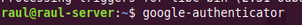

# Pràctica 5.2 – SSH amb MFA (Autenticació Multifactor)

## Requisits abans de començar la pràctica

!!!danger "Atenció, molt important abans de començar!"

    + Heu de tenir el servici SSH funcionant correctament i preferiblement haver fet la pràctica 5.1 completa
   
    + Heu de baixar-vos la app “Latch” al mòbil o, en el seu defecte, “Google Authenticator”

    + Heu de canviar en l'arxiu sshd_config el port d'escolta de nou al 22 (1 punt)

!!!info "Nota - Descripció de les màquines"

    Heu de posar al principi de l'informe de la pràctica aquest apartat, indicant què màquines heu utilitzat en la pràctica i amb quines IPs:

    | Màquina      |    IP     |
    | :----------- | :-------: |
    | Client SSH   | 172.1.X.X |
    | Servidor SSH | 172.1.X.X |
    | ...          |    ...    |

## Introducció
### Què és l'autenticació multifactor?

L'autenticació multifactor (MFA) és un mètode en el qual es proporciona accés a un sistema o servici sol després que puguis demostrar que efectivament ets tu qui dius ser. Ho faràs presentant dos o més evidències (o factors).

Aquests poden ser una **contrasenya** que tingui un codi de verificació secundari, un certificat digital instal·lat en l'equip, una pregunta personal, etc. És clar que quantes més capes de protecció posis millor vas a poder protegir els teus comptes.

Normalment se solen compaginar els següents factors:

* **Alguna cosa que conec:** una contrasenya, resposta a una pregunta, un PIN, etc.

* **Alguna cosa que obtinc:** una notificació que rebo en el mòbil, un codi de seguretat, etc. 

* **Alguna cosa únic que tinc:** en aquest cas és la biometria, com la teva empremta digital i/o el reconeixement facial. 

### Com ho implementem?

Anem a partir de la pràctica anterior, on ja podem connectar-nos per SSH al nostre proxy invers.

Necessitarem instal·lar en el nostre mòbil l'aplicació Latch d'Elevin Paths. També podríem utilitzar l'aplicació Google Authenticator.

No obstant això, l'elecció de Latch enfront de Google Authenticator està basada en [diverses consideracions de seguretat](https://www-elladodelmal-com.translate.goog/2016/10/latch-cloud-totp-versus-google.html?_x_tr_sl=es&_x_tr_tl=ca&_x_tr_hl=es). Google Authenticator:

+ No garanteix un únic dispositiu

+ La llavor es podia robar del backup

+ En Google Authenticator s'indica l'usuari

+ En Google no implementen correctament les alertes TOTP (Time-based One-Time Password algorithm)


## Instal·lació i configuració de MFA per a OpenSSH

### Instal·lació i configuració del mòdul PAM de Google

Ara que ja hem configurat SSH para no necessitar introduir el password cada vegada que fem login, anem a implementar el 2FA o segon factor d'autenticació per a major seguretat. Això és el que es coneix com fer “hardening” o fortificació de servidors.

!!!Danger "Atenció"
    Ens connectarem per SSH al proxy invers i realitzarem tota la configuració d'aquesta pràctica estant connectats per SSH.

    Si necessiteu fer proves de noves connexions, podeu obrir una altra pestanya del terminal sense desconnectar-vos.

Els passos que s'han de seguir són els següents:

+ Fer un update del sistema:

    

+ Instal·lar el mòdul d'autenticació de Google per a Ubuntu:
  
    

!!!Failure "Avís"
    Nota: si rebeu aquest missatge “I: Unable to locate package libpam-google-authenticator”, cal activar el repositori Universe amb el comando: 
    
    ```sh
    $sudo add-apt-repository universe   
    ```

+ Una vegada instal·lat, s'executa:
  
    

I vos anirà fent una sèrie de preguntes que heu de respondre. La primera us pregunta si el codi deu canviar aleatòriament en el temps, a la qual cosa heu de respondre sí. Us generarà el codi QR que heu d'escanejar amb el mòbil i els codis de recuperació.


En la app Latch heu d'anar a la secció “TOTP” i “Afegir compte”:
 
{: style="height:600px;width:300px"}

I després escanejar el codi QR que us ha aparegut abans:

{: style="height:600px;width:300px"}

La següent pregunta és si voleu que actualitze automàticament l'arxiu ```google_authenticator```, cosa necessària perquè funcione el 2FA, ergo heu de respondre sí novament:


En la següent pregunta, en respondre que sí, li indiqueu que el codi que useu caduqui en aquest mateix instant. Això vol dir que només es podrà realitzar un login cada 30 segons però augmentarà la protecció enfront d'atacs automatitzats:


Per defecte els codis es generen cada 30 segons, deixant un petit marge temporal on el codi anterior i el posterior seguiran sent vàlids. Això és per compensar certs desajustaments temporals entre l'hora del servidor i del client. 

Aquí respondrem que no doncs aquest marge és suficient i podria comprometre la seguridad de l'augmentar-ho:


Per protegir el nostre servidor contra atacs de força bruta respondrem que sí a la pregunta de permetre un màxim de 3 intents de login cada 30 segons:


## Configurar OpenSSH

!!!Tip "Nota important"
    Ja que realitzarem canvis per SSH estant connectats per SSH, és molt important no tancar mai la connexió SSH inicial per no córrer el risc de perdre l'accés al servidor. 

Per fer proves, establirem una nova connexió SSH i quan comprovem que tot funciona, podran tancar-se totes les sessions.

Ara hem de configurar el servici d'autenticació de Linux perquè sigui conscient que pot utilitzar l'autenticació de Google. Editem l'arxiu ```/etc/pam.d/sshd```:


I afegirem al final de l'arxiu la línia:


El ```nullok``` del final servicix per indicar-li al mecanisme d'autorització centralitzat de Linux, PAM (Pluggable Authentication Modulis) que aquest mètode d'autenticació és opcional. D'aquesta forma permetrem que els usuaris que no utilitzin el 2FA, puguin seguir fent login encara usant les seves claus.

A continuació hem de configurar l'arxiu de configuració del servici SSH perquè suporti aquest tipus de autenticación:


Guardem l'arxiu i reiniciem el servici:


### Fent que SSH sigui conscient de l'autenticació multifactor 

Reobrim l'arxiu de configuració del servici ssh:


I afegim aquesta línia al final de l'arxiu, per indicar-li al SSH que mètodes d'autenticació es requereixen. Això li indica a SSH que necessitem o una clau SSH, o un password o un codi de verificació (o les tres coses):


Tanquem i guardem aquest arxiu.

Ara tornem a obrir l'arxiu de configuració de PAM:


Hem de buscar i comentar la línia indicada per dir-li a PAM que no mostri l'opció d'introduir password:


Guardem i tanquem l'arxiu. 

Tot seguit reiniciem el servici:


Ara heu d'intentar fer login de nou en el server. En aquesta ocasió hauria de demanar-vos el codi de verificació. 

Aquest codi de verificació és el que apareix en Latch cada 30 segons, així que haureu de consultar-ho en el mòbil, introduir-ho i si tot va bé, estareu logueats.


{: style="height:600px;width:300px"}

A pesar que no s'explicita, s'han usat tant les claus SSH com el codi de verificació, és a dir, dos factors. Per verificar-ho, feu el ssh amb l'opció -v (de verbose) per poder comprovar-ho:


En **1** podeu veure que es produeix l'autenticació mitjançant claus, resultant en una autenticació parcial. 

Quedaria la segona part, que es correspon amb la part configurada com a interactiva amb el teclat (*keyboard-interactive*), que no és mes que introduir el codi temporal de Latch, com us diu en **2**.


!!!Task "Comprovació del doble factor d'autenticació"
    Comprova-ho connectant-te per SSH des de l'ordinador amfitrió (Lliurex o Windows) utilitzant la IP de la LAN i també des del client Xubuntu utilitzant el nom del DNS (proxy-server).

    Adjunta unes captures de pantalles, utilitzant l'opció “-v” i indica, recuadrant-lo, on es pot veure que ha utilitzat tots dos factors d'autenticació.

### Afegint un tercer factor d'autenticació

En la fase 3 hem llistat diversos tipus d'autenticació permeses, en l'arxiu de configuració sshd_config:

+ Claus públiques (publickey)

+ Password (password publickey)

+ Codi de verificació (keyboard-interactive)

Però malgrat això, només hem permès el login mitjançant clau pública + codi de verificació.

Si volguéssim tenir els tres factors, es podria realitzar amb un canvi ràpid. Simplement caldria descomentar la línia que hem comentat abans en l'arxiu ```/etc/pam.d/sshd```:


I reiniciar el servici.

Després d'això, en intentar fer el ssh, ens demanarà el password a més del codi de verificació:


!!!Task "Comprovación de login correcte amb els tres factors d'autenticació"
    Comprova-ho connectant-te per SSH des de l'ordinador amfitrió (Lliurex o Windows) utilitzant la IP de la LAN i també des del client Xubuntu utilitzant el nom del DNS (proxy-server).

    Adjunta una captura amb l'opció “-v” on indiquis, amb un requadre, on s'estan utilitzant cadascun dels tres factors.

## Qüestions finals

!!!Task "Questió 1"
    Descriu de quina manera podríem recuperar l'accés al servidor en cas de:

    + Perdre les claus (SSH o TOTP)

    + Perdre l'accés a l'aplicació Latch

    [Pista](https://www.digitalocean.com/community/tutorials/how-to-set-up-multi-factor-authentication-for-ssh-on-ubuntu-16-04)

!!!Task "Qüestió 2"
    Imagina que tenim un usuari al sistema únicament per realitzar tasques automatitzades mitjançant SFTP. Aquest usuari, òbviament, no serà capaç d'introduir cap codi de verificació ja que forma part d'unes tasques teòriques automatitzades per algun script.

    Indica què faries perquè només aquest usuari estigués exempt d'introduir el codi de verificació, deixant-lo activat per a la resta. 

    Pista: ```user exempt ssh 2FA exception```

## Avaluació

| Criteri                                                                                                                     | Puntuació  |
| :-------------------------------------------------------------------------------------------------------------------------- | :--------: |
| Instal·lació, configuració de 2FA per a OpenSSH i comprovació                                                                                           | **4 punts** |
| Afegir un 3er factor d'autenticació de forma correcta i comprovacions                                                                                                                     | **3.5 punts** |
| Fer configuració íntegrament vía SSH                                                                                                                  | **1 punt** |
| Qüestions finals                                                                                                                            | **1 punt** |
| S'ha tingut cura amb el format del document, utilitzant la plantilla actualitzada i fent ús d'un correcte llenguatge tècnic | **0.5 punts**  |


