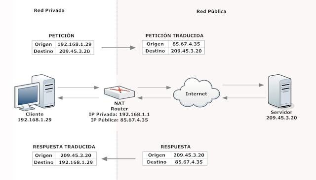

# Projecte final - Configuració de servicis

## Requisits abans de començar la pràctica

!!!danger "Atenció, molt important abans de començar!"

    + Heu de tenir funcionant totes les pràctiques del curs, fins a la 5.2, per poder començar adequadament aquesta pràctica
   
    + Comprovar que **REALMENT** tot està funcionant

    + Tenir a mà els informes de pràctiques anteriors, per consultar-los

!!!info "Nota - Descripció de les màquines"

    Per a aquest projecte, les IP que han de tenir les màquines són:

    | Màquina      |    IP     |
    | :----------- | :-------: |
    | Webserver1   | 172.1.X.X |
    | Webserver2 | 172.1.X.X |
    | Proxy invers | | 
    |  |- Interfaz de la xarxa **172.1.X.0/24**: `172.1.X.3`|
    |  |- Interfaz de la xarxa **10.X.0.0/16**: `10.X.0.1`|
    |  |- Interfaz de la **LAN**:` La que vos assigne el router de classe/casa`|
    |Client Xubuntu  |`10.X.0.2`|
    


## Introducció i motivació del projecte

En aquest projecte integrarem tots els servicis que hem vist durant el curs en un escenari semblant al que utilitzem en les darreres pràctiques del tema 4.

Com a afegit, protegirem tots els servicis de la nostra xarxa, una cosa summament important a la vida real, utilitzant un firewall.

En primera instància, configurarem la nostra xarxa i els servicis de cada màquina. Un cop estiguin funcionant i així ho haguem comprovat, llavors i només llavors, passarem a configurar les regles del nostre firewall.

Aquest projecte intenta simular, en la mesura que sigui possible, un escenari real del món laboral.

## Diagrama de xarxa i servicis a configurar

Després de muntar i configurar adequadament cada màquina, l'escenari final que hem d'aconseguir és el que es veu a la imatge de baix:


!!!Info
    A continuació, els aspectes a considerar per a la a configuració

1. Fixeu-vos que hi ha tres xarxes diferents, la 172.1.X.0/24, la 10.0.0.0/16 i la xarxa LAN, que serà del tipus 192.168.XX/24 (les X depenen de si esteu a l'institut o a casa).

2. Tot i estar en xarxes diferents, serà el webserver1 el que, mitjançant DHCP, assigni la IP al client Xubuntu → **El proxy invers actuarà per tant com a DHCP-RELAY**

3. El servidor DNS del client Xubuntu serà el servidor intermediari invers. No obstant això, el servidor DNS que resoldrà tots els noms de les màquines (webserver1, dnsserver, servidor intermediari, balanceig…), serà webserver1 → **El proxy invers actuarà com a DNS FORWARDER**, redirigint les peticions al webserver1 oa altres, segons calgui

4. Podrem connectar-nos per SSH a qualsevol dels 3 servidors, tant des del client Xubuntu com des de la LAN (el nostre ordinador físic)

5. La pràctica 4.5 ha de continuar funcionant perfectament, és a dir, haurem d'accedir sempre a https://balanceig (o que ens redirigeixi si accedim mitjançant http://balanceig) i comprovar que, efectivament, aquest balanceig es produeix. 

Partirem doncs de les màquines que hem anat creant al llarg del curs. A continuació us detalle què ha de tindre configurat cada màquina.

### Webserver1

Aquest servidor ha de conservar els servicis que ja teniu configurat (DHCP, DNS, HTTP). Tot i això, hem de modificar alguns punts.

#### Interfaces de xarxa

Heu de configurar netplan perquè es complisca:

1. Només ha de tenir 1 interfaz de xarxa, que serà una xarxa interna amb nom “Xarxa_172”

2. Com que un servidor DHCP no pot assignar-se una IP a si mateix, la IP estarà configurada manualment a netplan (això ja ho hauríeu de tenir així)

3. Perquè aquesta màquina pugui accedir a qualsevol lloc i altres màquines hi puguin accedir, necessita un gateway per defecte o porta d'enllaç. 

    + Com que la IP és manual, no ho podem assignar amb el DHCP com solem fer
  
    + La solució és configurar-lo al fitxer de netplan. Heu de canviar el que està en les línies marcades en groc:
  
```yaml hl_lines="1 3 6 14"
enp0sX:
    #Assignem IP manualment
    addresses: [172.1.X.1/24]
    #Configurem servidor DNS i domini manualment
    nameservers:
        addresses: [172.1.X.1]
        search: [sre.es]
        #Afegim una ruta estàtica
        #to: 0.0.0.0/0 fa referència a la ruta per accedir a qualsevol xarxa que existeixi
        #via: XXXX ← aquí heu de posar quina serà la porta d'enllaç sempre per
        # qualsevol ruta
        routes:
        - to: 0.0.0.0/0
        via: XXXX
```
#### DHCP

Heu de configurar el servidor DHCP perquè es compleixi:

1. El servidor DHCP ha de donar una IP fixa al ```webserver2``` ia la interfaz del proxy invers que està a la xarxa ```172.1.X.0/24``` (això ja ho hauríeu de tindre configurat)
2. Heu de definir la nova subnet ```10.X.0.0/16``` amb tots els paràmetres necessaris (option-routers, domain-name-servers, domain-name…) i assignar una IP fixa (```10.X.0.2```) d'aquesta subxarxa al client Xubuntu.
    
    !!!Tip
        Com a referència, teniu la pràctica 2.1.


#### DNS

1. Hem d'afegir les dades adequades al fitxer ```named.conf.options```
 
    + A l'ACL `confiables` hem d'afegir la IP de la interfaz corresponent del proxy invers, per permetre que faci consultes sobre aquest servidor Bind9.


#### SSH

1. Instal·larem openssh-server sense cap configuració addicional

#### HTTP

1. Com s'ha comentat, Nginx no necessita cap configuració addicional, simplement ha de continuar funcionant correctament


### Webserver2

#### Interfaces de xarxa

Heu de configurar `netplan` perquè es compleixi:

1. Només ha de tenir 1 interfaz de xarxa, que serà una xarxa interna amb nom `Xarxa_172`

2. Aquesta màquina ha de tenir assignada una IP fixa mitjançant el DHCP de `Webserver1` i amb gateway o porta d'enllaç la interfaz de la `Xarxa_172` del proxy-invers (això ja hauríeu de tenir-ho configurat). 

#### SSH

1. Instal·larem openssh-server sense cap configuració addicional

#### HTTP

1. Com s'ha comentat, Nginx no necessita cap configuració addicional, simplement ha de continuar funcionant correctament

### Proxy-server

#### Interfaces de xarxa

Heu de configurar netplan perquè es compleixi:

1. **Ha de tenir 3 interfaces de xarxa**
   
     (a) Una pertanyerà a la xarxa interna “Xarxa_172”

     (b) Una tercera serà un adaptador en mode bridge o pont, amb la LAN

     (c) Una altra pertanyerà a la xarxa interna “Red_10”

2. La primera interfaz `(a)` estarà configurada al fitxer de netplan perquè obtingui la IP mitjançant DHCP (el de `webserver1`)

     No obstant això, cal afegir alguna cosa en aquesta configuració. L'apartat corresponent a aquesta interfaz ha de lluir així:

     

     Això és perquè aquesta interfaz ha de tenir assignada per DHCP la IP `172.1.1.3` però a l'arxiu de configuració del DHCP també us enviem que la porta d'enllaç sigui `172.1.1.3`, és a dir, ell mateix. Això dóna problemes, principalment amb el NAT, que veurem més endavant.

     Amb `dhcp4-overrides` li estem dient que ignore determinats paràmetres que li arribin des del DHCP. Amb `use-routes: no` el que li diem és que el paràmetre a ignorar serà `option routers 172.1.1.3`, és a dir, la porta d'enllaç.

3. La segona interfaz `(b)` estarà configurada per obtenir la seva IP mitjançant DHCP (en aquest cas serà del router de classe/casa).

4. La tercera interfaz de xarxa `(c)` en comptes d'obtenir la seva IP per DHCP, la tindrà configurada de forma manual al fitxer de netplan. Només caldrà configurar la IP, cap paràmetre més.


#### DHCP

El proxy invers separa 3 xarxes unes de les altres i actua com a router. Aquestes tres xarxes són la `172.1.X.0/24`, la `10.X.0.0/16` i la `192.168.X.0/24`.

Si mirem una vegada més el diagrama de xarxa, el client Xubuntu ha d'obtindre una IP fixa mitjançant el servidor DHCP que funciona a webserver1 → Són xarxes diferents → Necessitem fer **DHCP RELAY**. 

Així doncs:

1. Hem d'instal·lar, si no en tenim ja, l'isc-dhcp-relay

2. Per configurar-ho podeu agafar com a referència la pràctica 2.1:

    + Mireu el diagrama de xarxa per veure quines interfaces cal posar a l'arxiu de configuració del relay
      
    + Poseu la IP correcta del servidor DHCP principalPer configurar-ho podeu agafar com a referència la pràctica 2.1.
     
    + S'ha d'executar com a dimoni a background (-D)


#### DNS

1. Hem d'instal·lar, si no el tenim ja, Bind9 al nostre proxy invers (en cas de tenir-lo instal·lat, compte amb la configuració que tingués d'abans, ja que no ens servirà)

2. Cal configurar aquest servidor DNS perquè sigui únicament forwarder, és a dir, perquè l'únic que faci sigui redirigir les consultes DNS del client Xubuntu al dnsserver/webserver1.

    A l'arxiu `named.conf.options`:

     + Heu de crear-vos una **acl** que s'anomeni `confiables`. Dins us heu de dir que les xarxes que s'inclouran en aquesta acl, que seran dels que s'acceptin les consultes i respostes de trànsit DNS,seran la xarxa on són els webservers i la xarxa on hi ha el client Xubuntu (teniu com a referència la pràctica 3.1).

     + A l'apartat de forwarders, en lloc d'afegir els servidors de Cloudflare i d'Opendns, com vam fer a la pràctica 3.2, posarem únicament la IP del dnsserver/webserver1, perquè només es redirigeixin consultes a aquest servidor des del servidor intermediari invers.

     + Prenent com a referència les configuracions del tema 3, haureu de permetre les consultes recursives i també heu d'indicar-vos que només les permeteu des de les xarxes que estan dins de l'acl fiables.

     + Finalment, haureu de configurar que escolteu al port 53 de les dues interfaces corresponents, tant la de la xarxa del client Xubuntu, com la de la xarxa on són els webservers.

        Per això heu de posar les IP de les dues interfaces del proxy invers que són a cadascuna de les dues xarxes.

     + Com que és un servidor DNS del tipus forwarder (només es dedica a redirigir consultes i respostes), ^^**no cal configurar cap zona**^^.

#### SSH

1. Com a configuració SSH, el proxy invers ha de conservar la que es va realitzar a les pràctiques del tema 5 (les directives adequades i autenticació multifactor).


#### HTTP

1. La configuració de NGINX no caldrà tocar-la, serà la mateixa que ja deixem funcionant al tema 4 (balanceig de càrrega, redirecció forçosa a https…).


### Client Xubuntu

#### Interfaces de xarxa

1. No canviarem la configuració, ha de continuar rebent la IP del servidor DHCP de `webserver1`

## Firewall 

### Què és un firewall?

Un firewall és un dispositiu de seguretat de la xarxa que monitoritza el trànsit entrant i sortint i decideix si ha de permetre o bloquejar un trànsit específic segons un conjunt de restriccions de seguretat ja definides.

Els firewalls han estat la primera línia de defensa en seguretat de la xarxa durant més de 25 anys. Estableixen una barrera entre les xarxes internes segures, controlades i fiables i les xarxes externes poc fiables com ara Internet.


Un firewall pot ser maquinari, programari o tots dos. En el nostre cas, implementarem el firewall mitjançant programari al nostre proxy invers.

Si el trànsit entrant o sortint compleix amb una sèrie de **regles** que nosaltres podem especificar, llavors el trànsit podrà accedir o sortir de la nostra xarxa o ordinador sense cap restricció. En cas de no complir les regles, el trànsit entrant o sortint serà bloquejat.

Per tant a partir de la definició podem assegurar que amb un firewall ben configurat podem evitar intrusions no desitjades a la nostra xarxa i ordinador així com també bloquejar cert tipus de trànsit sortint del nostre ordinador o la nostra xarxa.

Per clarificar aquest concepte farem servir una metàfora molt senzilla: un firewall és a una xarxa informàtica el que una porta a una casa. Aquesta porta impedeix l'entrada de persones desconegudes a casa nostra igual que un tallafocs bloqueja l'arribada d'usuaris no autoritzats a una xarxa privada.

La funció d'un firewall és molt important, ja que, si no fos per ell, un ordinador –o xarxa d'ordinadors– podria ser atacat i infectat amb força freqüència. 

### Firwalls en Linux

Hi ha diversos firewalls per a Linux, però potser el més conegut i utilitzat és **iptables**, ja que ve instal·lat per defecte a la majoria de distribucions.

A dia de hui, iptables porta un temps considerat obsolet (tot i que pot continuar utilitzant-se) i és **nftables** el firewall de referència actual, destinat a substituir-lo.

Un frontend és un programa que gestiona i/o administra les regles del firewall. Suposadament fa més fàcil la configuració i el manteniment. Hi ha dos frontends importants per a firewalls a Linux:

+ ^^Firewalld:^^ Desenvolupat per l'empresa Red Hat, ve instal·lat per defecte en distribucions com ara RHEL, Fedora, Suse o OpenSuse. 
    Al principi gestionava les regles d'iptables, avui dia gestiona les de nftables.

+ ^^UFW (Uncomplicated Firewall):^^ Ve instal·lat per defecte en distribucions Debian i derivats (Ubuntu, Mint…). Podeu gestionar les regles d'iptables i nftables.

En el nostre cas nosaltres no farem servir un frontend que pugui arribar a resultar encara més confús. Configurarem directament el firewall nftables.

Tot i que les regles de nftables es poden ficar per línia d'ordres una a una, nosaltres ho farem d'una manera una mica més “professional”, usant un script amb totes les regles per poder establir-les de cop sempre que ho necessitem.

### Com funciona nftables?

Nftables té configurades unes taules on es emmagatzemen les regles que regulen els tipus d'operacions es realitzaran sobre els paquets.

Cada taula conté llistes de regles anomenades cadenes. El tallafoc utilitza cadenes estàndard per manejar paquets en funció de circumstàncies predefinides. 
L'administrador pot crear altres cadenes.

Quan un paquet arriba al firewall, consulta les taules que té creades per saber què fer amb ell. 

Una de les diferències d'usar nftables és que les taules i les cadenes són totalment configurables. En nftables el primer que hem de fer és crear les taules (són les zones on crearem les diferents regles del tallafocs classificades en cadenes). A continuació crearem les diferents cadenes a les taules (que ens permet classificar les regles).

#### Creació de les taules

En el nostre cas crearem dues taules, una trucada ***filtrat*** per filtrar els paquets i una altra que s'anomeni nat per dur a terme el ***nat***, que explicarem més endavant.

```yaml
# TAULES
#==============
# Creem les taules
add table ip filtrat
add table ip nat
```

#### Creació de les cadenes

A continuació crearem les cadenes de la taula filtrat Per crear una cadena hem d'indicar diversos paràmetres:

+ **type**: És la classe de cadena que crearem, per exemple filtre (per filtrar) o nat (per fer NAT). 
 
+ **hook**: Determina el tipus de paquet que s'analitzarà. Per exemple:
  
    * ^^input^^: Paquets que tenen com a destinació la mateixa màquina. 

    * ^^output^^: Paquets que tenen origen la pròpia màquina.

    * ^^forward^^: Paquets que passen per la màquina

    * ^^prerouting^^: Paquets que entren a la màquina abans d'enrutar-los. Ens permeten fer DNAT

          * DNAT o NAT de destinació permet cambiar l'adreça de destinació d'un paquet (també podeu especificar el port de destinació).

+ **priority**: Ens permet ordenar les cadenes dins una mateixa taula. Les cadenes més prioritàries són les que tenen un nombre més petit.
  
+ **policy**: S'indica la política per defecte. Si el conjunt de regles avaluades no s'ajusta al paquet, s'executa la política per defecte. Per defecte la política ésacceptper això s'accepten tots els paquets que no s'ajustin al conjunt de regles. Quan desenvolupem un tallafocs la política sol serdrop no acceptant els paquets que no s'ajusten a capuna regla. 
  
Nosaltres crearem 5 cadenes:

```sh
# CADENES
#=================================================
# Creem les cadenes per a les taules que, per defecte, bloquejaran el trànsit
add chain ip filtratge INPUT { type filter hook input priority 0; policy drop; }
add chain ip filtratge FORWARD { type filter hook forward priority 0; policy drop; }
add chain ip filtratge OUTPUT { type filter hook output priority 0; policy drop; }
add chain ip nat POSTROUTING { type nat hook postrouting priority 100; }
add chain ip nat PREROUTING { type nat hook prerouting priority 0;
```
Quan tingam configurat la taula i les cadenes del nostre tallafocs, podem començar a configurar regles per configurar el nostre tallafocs personal, que filtrarà la comunicació a la nostra pròpia màquina.

### Flux d'accions quan un paquet arriba al firewall

Aquest esquema representa què passa quan el trànsit arriba al firewall, en quin ordre es consulten les taules que tenim i quines accions podem fer amb les cadenes d'aquestes taules:


Ja sabem que el servidor intermediari invers el fem servir per separar les 3 xarxes a les que està connectat, les dues privades i la LAN externa de casa/classe. 

Com que separa xarxes, actua com a router. Així doncs, quan el trànsit va dirigit directament al mateix proxy (una connexió SSH cap a ell, una consulta DNS al vostre servidor bind9, un accés http a http://balanceig…), és un procés local.

En canvi, quan el trànsit ha de travessar el proxy i ha de ser encaminat pel proxy (tràfic http entre els webservers i el client Xubuntu, p. ex.), estarem parlant de la taula FORWARD.

### Què és el NAT?

La idea és senzilla, fer que xarxes d'ordinadors utilitzen un rang dadreças especials (IPs privades) i es connectin a Internet usant una única adreça IP (IP pública). 

Gràcies a aquest “parxe”, les grans empreses només utilitzarien una adreça IP i no tantes com màquines hi hagués en aquesta empresa. També es fa servir per connectar xarxes domèstiques a Internet.



## Configuració de nftables

En primer lloc hem d'instal·lar nftables si no el tenim instal·lat ja:

```sh
$ sudo apt install nftables
```

I comprovar que està actiu:

```sh 
$ systemctl status nft
```

Al directori arrel del vostre servidor creareu el directori fw i dins, creareu l'arxiu reglas_fw.sh, que serà l'script on configurarem tot allò referent a nftables. 
Per crear aquest fitxer heu d'utilitzar la plantilla que us proporciono i que anirem completant a classe.

Coses que anirem configurant en aquest script:

1. Definirem les IP que utilitzarem, utilitzant noms fàcils d'identificar i comprendre, per no haver de posar la IP a cadascuna de les regles

2. Definirem noms per agrupar diversos ports, de manera que no haurem d'introduir la mateixa regla diverses vegades per a diferents ports, sinó que els aplicarem a l'agrupament.

3. Anem a netejar les regles de nftables que pogués haver configurades prèviament, per tal d'evitar-nos errors

    !!!Warning "Nota important"
        Si la configuració del firewall és errònia perquè us heu equivocat amb les regles, podeu eliminar-les totes amb l'ordre (al terminal):
        ```sh
        $ nft flush ruleset
        ```

4. Creem les taules

5. Creem les cadenes

A partir d'aquí comencem a configurar les regles que formarà cadascuna de les cadenes:

6. Regles per al NAT: així permetrem que el client Xubuntu pugui tenir accés a internet

7. Regles per permetre les consultes DNS del client al servidor intermediari invers. També, ja que el servidor intermediari invers no és més que un DNS forwarder, hem d'incloure regles que permetin al servidor intermediari consultar al webserver1

8. Regles que permetin connectar-nos al servidor intermediari invers per SSH, tant des de la LAN com des del client Xubuntu

9. Permetre que els paquets siguin encaminats a través del proxy invers. Trànsit que passa a través d'aquest servidor intermediari:

    + Tràfic del NAT: permet que el client Xubuntu pugui navegar per Internet. És a dir, permet el trànsit HTTP del client a través del proxy invers i cap a internet.

    + Tràfic SSH des del client Xubuntu als webservers

    + Tràfic SSH des de la xarxa LAN cap als webservers

10. Finalment, des de la LAN només ens podem connectar per SSH (port 22) al proxy invers però no als webservers, ja que estan en una xarxa interna privada.

    + Crearem una regla del firewall que escolti als ports 8001 i 8002. Quan ens intentem connectar per SSH a aquests ports, ens redirigirà automàticament als ports 22 de webserver1 i webserver2, respectivament.
  
    + Això vol dir que abans que el proxy invers, com a router que és, prengui la decisió d'on encamineu el paquet, canvieu l'adreça destinació per la de webserver1/2 i el port destinació pel 22.

Per executar l'script i que apliqui totes les cadenes de regles que hem configurat, hem d'executar:

```sh
$ nft -f regles_fw.sh
```

!!!Note "Recordatori"
    Si volem netejar les regles i desactivar el tallafoc:
    
    ```sh
    $ sudo nft flush ruleset
    $ sudo systemctl stop nftables
    ```

    Si volem llistar les regles configurades:

    ```sh
    $ sudo nft list ruleset
    ```

    Per veure els comptadors en temps real:

    ```sh
    $ watch nft list ruleset
    ```

## Què cal lliurar?

Cal documentar TOTA la pràctica, així que un informe on vos hagiu fet:

1. Documentar totes les configuracions noves i/o canvis de configuració que s'hagin fet, adjuntant captures de pantalla
   
2. Per demostrar que els servicis funcionen correctament → **ARXIUS DE LOG** de les peticions i/o respostes del servei
   
3. Captura de la sortida de l'ordre ```$ sudo nft list ruleset``` on es vegi que s'han utilitzat o aplicat totes les regles, és a dir, que ***TOTS ELS COMPTADORS SÓN > 0.***


